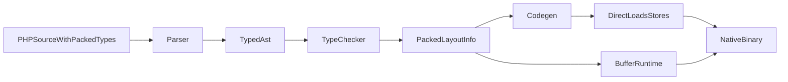

# Piano per un tipo hot-path esplicito

## Obiettivo

Introdurre in elephc una nuova astrazione dati per inner loop di giochi e renderer, separata dagli array PHP gestiti. Il target e' ottenere accesso contiguo, layout prevedibile e zero hash lookup, mantenendo la logica di alto livello in PHP.

## Scelta di design consigliata

La strada meno rischiosa e piu' performante e' **aggiungere un tipo compiler-specifico packed/SoA**, non cercare di far diventare gli `array` PHP il contenitore giusto per i path caldi.

Perche':

- Gli assoc array passano da `__rt_hash_get` e quindi ogni accesso e' una lookup runtime, non un load diretto: [src/codegen/expr/arrays.rs](/Volumes/Crucio/Developer/illegal.studio/elephc/src/codegen/expr/arrays.rs), [src/codegen/runtime/arrays/hash_get.rs](/Volumes/Crucio/Developer/illegal.studio/elephc/src/codegen/runtime/arrays/hash_get.rs).
- Gli array indicizzati vivono comunque nel runtime heap/COW: [src/codegen/runtime/arrays/array_new.rs](/Volumes/Crucio/Developer/illegal.studio/elephc/src/codegen/runtime/arrays/array_new.rs).
- Esistono gia' i ganci giusti per un percorso piu' basso livello: `PhpType::Pointer`, `ExternClassInfo`, field offsets e property access su `ptr<T>`: [src/types/mod.rs](/Volumes/Crucio/Developer/illegal.studio/elephc/src/types/mod.rs), [src/codegen/expr/objects/access.rs](/Volumes/Crucio/Developer/illegal.studio/elephc/src/codegen/expr/objects/access.rs).

## Forma iniziale proposta

Partire con una feature esplicita e minimale, ad esempio una di queste due forme:

- `packed class` / `extern-like class` allocabile da elephc, con layout POD fisso e accesso a campi a offset statici.
- `buffer<T>` o `packed_array<T>` come contenitore contiguo di POD (`int`, `float`, `bool`, `ptr`, oppure `packed class`).

Raccomandazione: iniziare da **`buffer<T>` + `packed class`**.

Perche':

- `packed class` da' un record denso e compilabile in offset statici.
- `buffer<T>` permette sia AoS (`buffer<EnemyPacked>`) sia SoA (`buffer<float> $enemyX`, `buffer<int> $enemyState`).
- Entrambi possono appoggiarsi a `malloc`/heap interno senza entrare nella semantica array/hash/COW.

## Vincoli semantici da fissare subito

Per avere prestazioni massime, il nuovo tipo deve essere volutamente piu' ristretto dei normali tipi PHP:

- Nessun `mixed` dentro i buffer hot-path.
- Solo tipi POD inizialmente: `int`, `float`, `bool`, `ptr`, e `packed class` composte solo da POD.
- Niente stringhe/array/object refcounted nella v1.
- Indice numerico soltanto, bounds check opzionale o esplicito.
- Nessuna semantica COW/refcount per elemento.
- Layout e stride completamente statici al compile time.

## Architettura proposta

## Moduli da toccare

### Parsing e AST

Estendere parser e AST per rappresentare il nuovo tipo e le operazioni base:

- Nuovi token/keyword o nuova sintassi tipo-generica in [src/lexer/token.rs](/Volumes/Crucio/Developer/illegal.studio/elephc/src/lexer/token.rs) e [src/parser/expr.rs](/Volumes/Crucio/Developer/illegal.studio/elephc/src/parser/expr.rs).
- Nuovi nodi in [src/parser/ast.rs](/Volumes/Crucio/Developer/illegal.studio/elephc/src/parser/ast.rs):
  - dichiarazione `packed class` oppure equivalente
  - tipo `Buffer<T>` / `PackedArray<T>`
  - accesso indicizzato hot-path
  - eventuali builtins tipo `buffer_new<T>($len)`

### Type checker

- Estendere [src/types/mod.rs](/Volumes/Crucio/Developer/illegal.studio/elephc/src/types/mod.rs) con tipi nuovi, ad esempio:
  - `PhpType::Packed(String)`
  - `PhpType::Buffer(Box<PhpType>)`
- Creare metadata statici analoghi a `ExternClassInfo`, ma per tipi packed nativi.
- Validare che gli elementi siano POD e calcolare `stride` e offset.
- Integrare ownership: i buffer devono stare fuori da `Mixed/Array/AssocArray/Object` e dal normale refcount per elemento.

### Codegen

- Nuovo path di emissione in [src/codegen/expr.rs](/Volumes/Crucio/Developer/illegal.studio/elephc/src/codegen/expr.rs) e sotto-moduli dedicati, evitando `__rt_hash_get` e le semantiche COW.
- Riutilizzare il modello gia' presente per accesso a campi a offset statici in [src/codegen/expr/objects/access.rs](/Volumes/Crucio/Developer/illegal.studio/elephc/src/codegen/expr/objects/access.rs).
- Generare indirizzo base + `index * stride` + `field_offset`, poi `ldr/str` diretti.

### Runtime

- Aggiungere un runtime minimo per allocazione buffer, idealmente separato dagli array PHP:
  - `__rt_buffer_new`
  - `__rt_buffer_free` o integrazione controllata col heap attuale
  - opzionale `__rt_buffer_bounds_fail`
- Evitare il coinvolgimento del path hash/array runtime, che oggi introduce il costo che vogliamo bypassare: [src/codegen/runtime/arrays/hash_get.rs](/Volumes/Crucio/Developer/illegal.studio/elephc/src/codegen/runtime/arrays/hash_get.rs), [src/codegen/runtime/arrays/array_new.rs](/Volumes/Crucio/Developer/illegal.studio/elephc/src/codegen/runtime/arrays/array_new.rs).

## Strategia di rollout

### Fase 1: MVP strettissimo

- `buffer<int>`
- `buffer<float>`
- `buffer<bool>`
- `buffer<ptr>`
- allocazione, lettura, scrittura, `count/len`
- nessuna crescita dinamica
- nessuna interoperabilita' automatica con array PHP

Questo basta gia' per:

- z-buffer
- colonne raycaster
- stati compatti
- arrays paralleli SoA per enemy/player/projectiles

### Fase 2: `packed class`

- `packed class EnemyPod { public float $x; public float $y; public int $state; public int $hp; }`
- supporto `buffer<EnemyPod>`
- accesso `$enemies[$i]->x` compilato come load diretto a offset statico

### Fase 3: ergonomia extra

- helper per slice/view
- eventuale `unsafe` mode per togliere bounds checks
- memset/memcpy builtins mirati
- conversioni esplicite da/verso array PHP per tooling/debug

## Criteri di successo per il design

Il nuovo tipo e' corretto se:

- l'accesso a elemento/campo non passa da hash lookup o tag dispatch
- il layout e' statico e ispezionabile
- non eredita COW/refcount per elemento dagli array PHP
- si integra bene con SDL/FFI e i pointer helpers gia' esistenti
- consente esempi di gameplay/render loop scritti in PHP con dati hot-path fuori dagli assoc array

## Test da prevedere

Seguire il pattern del progetto con test lexer/parser/typechecker/codegen:

- parser del nuovo tipo e della nuova sintassi
- type errors su tipi non POD
- codegen tests per lettura/scrittura in loop
- test FFI/interoperabilita' con `ptr_cast` e layout packed
- benchmark micro per confrontare:
  - assoc array
  - array indicizzato PHP
  - nuovo `buffer<T>`

## Rischi principali

- Se si cerca di rendere `array` PHP stesso “veloce”, si entra in conflitto con hash/COW/refcount e si allarga troppo il blast radius.
- Se `packed class` accetta tipi heap-managed troppo presto, si perde il vantaggio del modello hot-path.
- Se la sintassi e' troppo ambiziosa nella v1, il costo parser/typechecker cresce senza dare subito valore al renderer.

## Raccomandazione finale

Puntare a un MVP con **`buffer<T>` per POD + poi `packed class`**, costruito sopra i meccanismi gia' presenti di layout statico e accesso a offset. E' la strada che massimizza le prestazioni e minimizza il rischio architetturale, lasciando gli array PHP al ruolo di strutture di alto livello e i nuovi buffer ai path caldi.
