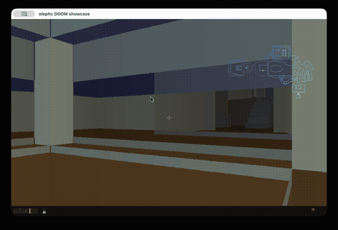

# elephc

[](https://github.com/illegalstudio/elephc/stargazers)
[](https://github.com/illegalstudio/elephc/releases)
[](https://github.com/illegalstudio/elephc)
[](LICENSE)

A PHP-to-native compiler. Takes a subset of PHP and compiles it directly to **ARM64 assembly**, producing **standalone macOS binaries**. No interpreter, no VM, no runtime dependencies.

> **If you like the idea or find it useful, please star the repo** — it helps others discover it and keeps the project going.

> **Want to support the project?** elephc is built and maintained independently. If you'd like to help it grow, consider [sponsoring on GitHub](https://github.com/sponsors/nahime0). Every contribution — big or small — makes a real difference.

## DOOM rendered in PHP

The flagship showcase: a real-time 3D renderer that loads original DOOM WAD files and renders E1M1 — BSP traversal, perspective projection, per-column fog, sector lighting, collision detection, step climbing — entirely in PHP compiled to a native ARM64 binary.



See [showcases/doom/](showcases/doom/) for full source and build instructions.

## Why

My first "serious programming" book was *PHP 4 and MySQL*. After years of experimenting with code, that book turned my passion into a profession. I've worked with many languages over the past 20 years, but PHP is the one that has most consistently put food on the table.

PHP has a simple, approachable, and elegant syntax. Millions of developers worldwide already know it well. That makes it an ideal bridge to bring web developers closer to lower-level programming — systems work, native binaries, understanding what happens under the hood — without forcing them to learn an entirely new language first.

One thing I always missed about PHP was the ability to produce optimized, fast native binaries. While everyone else is busy building the next Facebook, I thought I could try to fill that gap and write a compiler for PHP.

Of course, PHP has its limits when it comes to performance-critical or systems-level work. That's why elephc introduces compiler extensions like `packed class` for flat POD records, `buffer<T>` for contiguous typed arrays, `ptr` for raw memory access, and `extern` for FFI — constructs that give PHP developers the tools they need without abandoning the language they already know.

It's not perfect, but **it works**. It's a solid starting point, and more importantly, it's a great way to understand **how a compiler works** and how assembly language operates under the hood.

I made the project as modular as possible. Every function has its own codegen file, and each one is **commented line by line**, so you can see exactly how a high-level construct gets translated into its low-level equivalent.

## What you can expect

You can write PHP using the constructs documented in the [docs](docs/). Classes with single inheritance, interfaces, abstract classes, traits, constructors, instance/static methods, `self::` / `parent::` / `static::` with late static binding, `readonly` properties and classes, enums, named arguments, first-class callables, typed parameters and returns, `try` / `catch` / `finally` / `throw`, visibility modifiers, union and nullable types, copy-on-write arrays, associative arrays with PHP insertion order, closures, namespaces, and includes.

For performance-oriented code, For performance-oriented code, elephc exposes compiler extensions beyond standard PHP — see the Why section above.

Then compile and run:

```bash
elephc myfile.php
./myfile
```

The compiler is experimental and evolving. Not everything PHP supports is implemented, and you will find bugs. But as the DOOM showcase demonstrates, you can build real, non-trivial programs with it today.

If you want to contribute, you're welcome. Mi casa es tu casa.

## Learn how a compiler works

elephc is designed to be read. **Every line of Rust that emits ARM64 assembly** is annotated with an inline comment explaining what it does and why — from stack frame setup to syscall invocation, from integer-to-string conversion to array memory layout. If you've ever wondered what happens between `echo "hello"` and the CPU executing it, follow the code from `src/codegen/` and read the comments. **No prior assembly knowledge required.**

## Requirements

- Rust toolchain (`cargo`)
- Xcode Command Line Tools (`xcode-select --install`)
- macOS on Apple Silicon (ARM64)

## Install

### Homebrew (recommended)

```bash
brew install illegalstudio/tap/elephc
```

### From source

```bash
git clone https://github.com/illegalstudio/elephc.git
cd elephc
cargo build --release
```

The binary is at `./target/release/elephc`.

### Manual download

Pre-built binaries are available on the [Releases](https://github.com/illegalstudio/elephc/releases) page. If macOS blocks the binary, run:

```bash
xattr -cr elephc
```

## Usage

```bash
# Compile a PHP file to a native binary
elephc hello.php
./hello

# Custom heap size (default: 8MB)
elephc --heap-size=16777216 heavy.php

# Enable runtime heap verification while debugging ownership issues
elephc --heap-debug heavy.php

# Print allocation/free counters to stderr while debugging GC behavior
elephc --gc-stats heavy.php

# Enable compile-time feature branches
elephc --define DEBUG app.php

# Link extra native libraries or frameworks for FFI
elephc app.php -l sqlite3 -L /opt/homebrew/lib --framework Cocoa

# Experimental target selection plumbing
# AArch64 emission works today; linux-x86_64 is recognized but not emitted yet
elephc --target linux-aarch64 hello.php
```

Or via cargo:

```bash
cargo run -- hello.php
./hello
```

## Showcases

| Showcase | Description |
|---|---|
| [DOOM E1M1](showcases/doom/) | Real-time 3D WAD renderer with BSP traversal, SDL2 FFI, `packed class` geometry, `buffer<T>` storage, collision detection, HUD |
| [SDL framebuffer](examples/sdl_framebuffer/) | Pixel-level rendering with SDL2 via FFI |
| [SDL audio](examples/sdl_audio/) | Audio playback with SDL2 via FFI |
| [Hot-path buffers](examples/hot-path/) | `packed class` + `buffer<T>` for performance-critical data |
| [FFI memory](examples/ffi-memory/) | Raw C memory patterns with `malloc`, `free`, `memcpy` via FFI |

## FFI

elephc can call native C functions directly through `extern` declarations.

```php
<?php
extern function atoi(string $s): int;
extern function signal(int $sig, callable $handler): ptr;
extern function raise(int $sig): int;
extern global ptr $environ;

function on_signal($sig) {
    echo "signal = " . $sig . "\n";
}

echo atoi("999") . "\n";
echo ptr_is_null($environ) ? "missing\n" : "ok\n";
signal(15, "on_signal");
raise(15);
```

Notes:

- `extern function`, `extern "lib" { ... }`, `extern global`, and `extern class` are supported.
- `string` arguments are copied to temporary null-terminated C strings for the duration of the native call.
- `string` return values are copied back into owned elephc strings.
- `callable` parameters pass a user-defined elephc function by string name, for example `"on_signal"`.
- Callback functions must stay C-compatible: use `int`, `float`, `bool`, `ptr`, or `void`-shaped values. String callbacks are not supported yet.
- Raw C memory patterns are supported through ordinary extern declarations such as `malloc`, `free`, `memcpy`, and `memset`.
- Pointer helpers include byte/word buffer access (`ptr_read8`, `ptr_read32`, `ptr_write8`, `ptr_write32`) in addition to `ptr_get` / `ptr_set`.

## What it compiles

elephc supports a growing subset of PHP and aims to match PHP behavior for the language features it implements.

```php
<?php
$pi = M_PI;
echo "Pi is approximately " . number_format($pi, 5) . "\n";
echo "2 ** 10 = " . (2 ** 10) . "\n";
echo "10 / 3 = " . (10 / 3) . "\n";
echo "Type: " . gettype($pi) . "\n";

$x = (int)$pi;
echo "Truncated: " . $x . "\n";

if ($x === 3) {
    echo "Correct!\n";
}
```

### Supported types

| Type | Example |
|---|---|
| `int` | `42`, `-7`, `PHP_INT_MAX` |
| `float` | `3.14`, `.5`, `1e-5`, `INF`, `NAN` |
| `string` | `"hello\n"`, `'raw'` |
| `bool` | `true`, `false` |
| `null` | `null` |
| `mixed` | `mixed $x = 42;`, `function show(mixed $x): string { ... }` |
| `array` | `[1, 2, 3]`, `["key" => "value"]`, `[[1,2],[3,4]]` (indexed, associative, multi-dimensional, copy-on-write) |
| `object` | `new Foo()`, `$user->name` |
| `pointer` | `ptr($x)`, `ptr_null()`, `ptr_cast<int>($p)` |
| `enum` | `enum Color: int { case Red = 1; }`, `Color::Red->value`, `Color::from(1)` |
| `int\|string` | `int\|string $x = 42;`, `function show(int\|string $x): string { ... }` |
| `?int` | `?int $x = null;`, `function find(): ?int { ... }` |
| `buffer<T>` | `buffer<int> $xs = buffer_new<int>(256)` |
| `packed class` | `packed class Vec2 { public float $x; public float $y; }` |

### Supported constructs

The full list of supported constructs, operators, and control structures is in the [docs](docs/). Highlights:

- **OOP**: classes, abstract classes, interfaces, traits, enums, `readonly`, static/instance methods, `self::`/`parent::`/`static::`, magic methods (`__toString`, `__get`, `__set`)
- **Functions**: default parameters, variadic/spread, pass by reference, named arguments, first-class callables, closures, arrow functions
- **Control flow**: if/elseif/else, while, do-while, for, foreach, switch, match, break, continue, try/catch/finally/throw
- **Types**: union types (`int|string`), nullable (`?int`), type casting, typed parameters and returns
- **Modules**: namespaces, use imports, include/require/require_once
- **FFI**: extern functions, extern blocks, extern globals, extern classes, pointer builtins
- **Extensions**: `ifdef`, `packed class`, `buffer<T>`, `buffer_new<T>()`, `buffer_len()`, `buffer_free()`

### Built-in functions (200+)

**Strings:** `strlen`, `substr`, `strpos`, `strrpos`, `strstr`, `str_replace`, `str_ireplace`, `substr_replace`, `strtolower`, `strtoupper`, `ucfirst`, `lcfirst`, `ucwords`, `trim`, `ltrim`, `rtrim`, `str_repeat`, `str_pad`, `strrev`, `str_split`, `strcmp`, `strcasecmp`, `str_contains`, `str_starts_with`, `str_ends_with`, `ord`, `chr`, `explode`, `implode`, `sprintf`, `printf`, `sscanf`, `md5`, `sha1`, `hash`, `number_format`, `intval`, `addslashes`, `stripslashes`, `nl2br`, `wordwrap`, `bin2hex`, `hex2bin`, `htmlspecialchars`, `htmlentities`, `html_entity_decode`, `urlencode`, `urldecode`, `rawurlencode`, `rawurldecode`, `base64_encode`, `base64_decode`, `ctype_alpha`, `ctype_digit`, `ctype_alnum`, `ctype_space`

**Arrays:** `count`, `array_push`, `array_pop`, `in_array`, `array_keys`, `array_values`, `sort`, `rsort`, `isset`, `array_key_exists`, `array_search`, `array_merge`, `array_slice`, `array_splice`, `array_combine`, `array_flip`, `array_reverse`, `array_unique`, `array_sum`, `array_product`, `array_chunk`, `array_pad`, `array_fill`, `array_fill_keys`, `array_diff`, `array_intersect`, `array_diff_key`, `array_intersect_key`, `array_unshift`, `array_shift`, `asort`, `arsort`, `ksort`, `krsort`, `natsort`, `natcasesort`, `shuffle`, `array_rand`, `array_column`, `range`, `array_map`, `array_filter`, `array_reduce`, `array_walk`, `usort`, `uksort`, `uasort`, `call_user_func`, `call_user_func_array`, `function_exists`

**Math:** `abs`, `floor`, `ceil`, `round`, `sqrt`, `pow`, `min`, `max`, `intdiv`, `fmod`, `fdiv`, `rand`, `mt_rand`, `random_int`, `sin`, `cos`, `tan`, `asin`, `acos`, `atan`, `atan2`, `sinh`, `cosh`, `tanh`, `log`, `log2`, `log10`, `exp`, `hypot`, `deg2rad`, `rad2deg`, `pi`

**Types:** `gettype`, `settype`, `empty`, `unset`, `is_int`, `is_float`, `is_string`, `is_bool`, `is_null`, `is_numeric`, `is_nan`, `is_finite`, `is_infinite`, `boolval`, `floatval`

**I/O:** `fopen`, `fclose`, `fread`, `fwrite`, `fgets`, `feof`, `readline`, `fseek`, `ftell`, `rewind`, `file_get_contents`, `file_put_contents`, `file`, `fgetcsv`, `fputcsv`, `file_exists`, `is_file`, `is_dir`, `is_readable`, `is_writable`, `filesize`, `filemtime`, `copy`, `rename`, `unlink`, `mkdir`, `rmdir`, `scandir`, `glob`, `getcwd`, `chdir`, `tempnam`, `sys_get_temp_dir`

**System:** `exit`, `die`, `time`, `microtime`, `date`, `mktime`, `strtotime`, `sleep`, `usleep`, `getenv`, `putenv`, `php_uname`, `phpversion`, `exec`, `shell_exec`, `system`, `passthru`, `json_encode`, `json_decode`, `json_last_error`, `preg_match`, `preg_match_all`, `preg_replace`, `preg_split`, `define`, `var_dump`, `print_r`

**Pointers/Buffers:** `ptr`, `ptr_null`, `ptr_is_null`, `ptr_get`, `ptr_set`, `ptr_read8`, `ptr_read32`, `ptr_write8`, `ptr_write32`, `ptr_offset`, `ptr_cast<T>`, `ptr_sizeof`, `buffer_new<T>`, `buffer_len`, `buffer_free`

### Constants

`INF`, `NAN`, `PHP_INT_MAX`, `PHP_INT_MIN`, `PHP_FLOAT_MAX`, `PHP_FLOAT_MIN`, `PHP_FLOAT_EPSILON`, `M_PI`, `M_E`, `M_SQRT2`, `M_PI_2`, `M_PI_4`, `M_LOG2E`, `M_LOG10E`, `PHP_EOL`, `PHP_OS`, `DIRECTORY_SEPARATOR`, `STDIN`, `STDOUT`, `STDERR`

User-defined constants are also supported via `const NAME = value;` and `define("NAME", value);`.

## How it works

```
PHP source → Lexer → Parser (AST) → Conditional (ifdef/--define) → Resolver (include) → NameResolver (namespaces/use/FQNs) → Type Checker → Codegen → as + ld → Mach-O binary
```

The compiler emits human-readable ARM64 assembly. You can inspect the `.s` file to see exactly what your PHP becomes:

```bash
elephc hello.php
cat hello.s
```

### Type system

The static type system tracks these runtime shapes at compile time:

- **Int** — 64-bit signed integer
- **Float** — 64-bit double-precision
- **Str** — pointer + length pair
- **Bool** — `true`/`false`, coerces to 0/1
- **Void / null** — null sentinel value, coerces to 0/""
- **Array** — indexed arrays with inferred element type
- **AssocArray** — associative arrays with key/value types
- **Mixed** — boxed runtime-tagged payload used for heterogeneous assoc-array values and user-facing `mixed` hints
- **Callable** — closures and callable function references
- **Object** — heap-allocated class instances
- **Pointer** — raw 64-bit addresses, optionally tagged via `ptr_cast<T>()`

A variable's type is set at first assignment. Compatible types (int/float/bool/null) can be reassigned between each other.

## Error messages

Errors include line and column numbers, and the compiler tries to recover far enough to report multiple independent syntax / semantic errors in one pass. Successful compilations may also emit non-fatal warnings such as unused variables / parameters or unreachable code:

```
error[3:1]: Undefined variable: $x
error[5:7]: Type error: cannot reassign $x from Int to Str
error[2:1]: Required file not found: 'missing.php'
warning[9:5]: Unused variable: $tmp
warning[14:9]: Unreachable code
```

## Project structure

High-level map of the source tree. The codebase contains more focused helper submodules than shown here; treat this as an orientation guide rather than a byte-for-byte file listing.

```
src/
├── main.rs              # CLI entry point, assembler + linker invocation
├── lib.rs               # Public module exports
├── span.rs              # Source position tracking (line, col)
├── conditional.rs       # Build-time `ifdef` pass driven by --define
├── resolver.rs          # Include/require file resolution
├── names.rs             # Qualified/FQN name model + symbol mangling helpers
├── name_resolver.rs     # Namespace/use resolution to canonical names
│
├── lexer/               # Source text → token stream
│   ├── token.rs         # Token enum
│   ├── scan.rs          # Main scanning loop, operators
│   ├── literals.rs      # String, number, variable, keyword scanning
│   └── cursor.rs        # Byte-level source reader
│
├── parser/              # Tokens → AST (Pratt parser)
│   ├── ast.rs           # ExprKind, StmtKind, BinOp, CastType
│   ├── expr.rs          # Expression parsing with binding powers
│   ├── stmt.rs          # Statement parsing
│   └── control.rs       # if, while, for, foreach, do-while
│
├── types/               # Static type checking
│   ├── mod.rs           # PhpType, TypeEnv, check(), CheckResult
│   ├── traits.rs        # Trait flattening and conflict resolution
│   ├── warnings.rs      # Non-fatal diagnostics (unused vars, unreachable code)
│   └── checker/
│       ├── mod.rs       # check_stmt(), infer_type()
│       ├── builtins.rs  # Built-in function type signatures
│       └── functions.rs # User function type inference
│
├── codegen/             # AST → ARM64 assembly
│   ├── mod.rs           # Pipeline entry, main/global codegen orchestration
│   ├── expr.rs          # Expression codegen dispatcher
│   ├── expr/            # Focused expression helpers (arrays, calls, objects, binops, ...)
│   ├── stmt.rs          # Statement codegen dispatcher
│   ├── stmt/            # Focused statement helpers (arrays, control_flow, io, storage, ...)
│   ├── abi.rs           # Register conventions (load, store, write)
│   ├── functions.rs     # User function emission
│   ├── ffi.rs           # Extern function/global/class codegen
│   ├── context.rs       # Variables, labels, loop stack
│   ├── data_section.rs  # String/float literal .data section
│   ├── emit.rs          # Assembly text buffer
│   │
│   ├── builtins/        # Built-in function codegen (one file per language function)
│   │   ├── strings/     # strlen, substr, strpos, explode, implode, ...
│   │   ├── arrays/      # count, array_push, array_pop, sort, ...
│   │   ├── math/        # abs, floor, pow, rand, fmod, ...
│   │   ├── types/       # is_int, gettype, empty, unset, settype, ...
│   │   ├── io/          # fopen, fclose, fread, fwrite, fgets, file_get_contents, ...
│   │   ├── pointers/    # ptr, ptr_get, ptr_set, ptr_read8, ptr_write8, ptr_offset, ...
│   │   └── system/      # exit, die, time, sleep, getenv, exec, ...
│   │
│   └── runtime/         # ARM64 runtime routines (one file per language/runtime helper)
│       ├── strings/     # itoa, concat, ftoa, strpos, str_replace, ...
│       ├── arrays/      # heap_alloc, array_new, array_push, sort, ...
│       ├── exceptions.rs # exception runtime orchestration / re-exports
│       ├── exceptions/  # setjmp/longjmp-based exception helpers
│       ├── io/          # fopen, fclose, fread, fwrite, file_ops, ...
│       ├── pointers/    # ptoa, ptr_check_nonnull, str_to_cstr, cstr_to_str
│       └── system/      # build_argv, time, getenv, shell_exec
│
└── errors/              # Error formatting with line:col
```

## Tests

1900+ tests across lexer, parser, codegen, and error reporting. Each codegen test compiles inline PHP source to a native binary, runs it, and asserts stdout.

```bash
cargo test                      # all tests
cargo test -- --include-ignored # all tests, including ignored integration tests
cargo test test_my_feature      # run specific tests
ELEPHC_PHP_CHECK=1 cargo test   # cross-check output with PHP interpreter
./scripts/test-linux-arm64.sh   # Linux ARM64 suite in Docker
./scripts/test-linux-x86_64.sh  # Linux x86_64 suite in Docker
```

## Documentation

The **[docs/](docs/)** directory is a complete wiki covering every aspect of the compiler. Inside you'll find:

- **PHP syntax reference** — types, operators, control structures, functions, classes, namespaces, and all 200+ built-in functions with signatures and examples
- **Compiler extensions** — pointers, `buffer<T>`, `packed class`, FFI with `extern`, and conditional compilation with `ifdef` — the features that take PHP beyond the web
- **Compiler internals** — a step-by-step walkthrough of the full pipeline, from lexing to Pratt parsing to type checking to ARM64 code generation, with every assembly line commented
- **ARM64 primer** — an introduction to ARM64 assembly for people who've never seen it, plus a quick reference of every instruction elephc uses
- **Memory model** — how the stack, heap, concat buffer, and hash tables work under the hood

If you're new to compilers or assembly, start from the top and work your way down. No prior low-level knowledge required.

For runnable language samples, see `examples/`. For a focused perf comparison, see `benchmarks/hot-path-buffer-vs-arrays`.

## License

MIT
