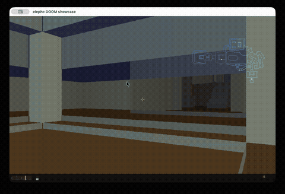
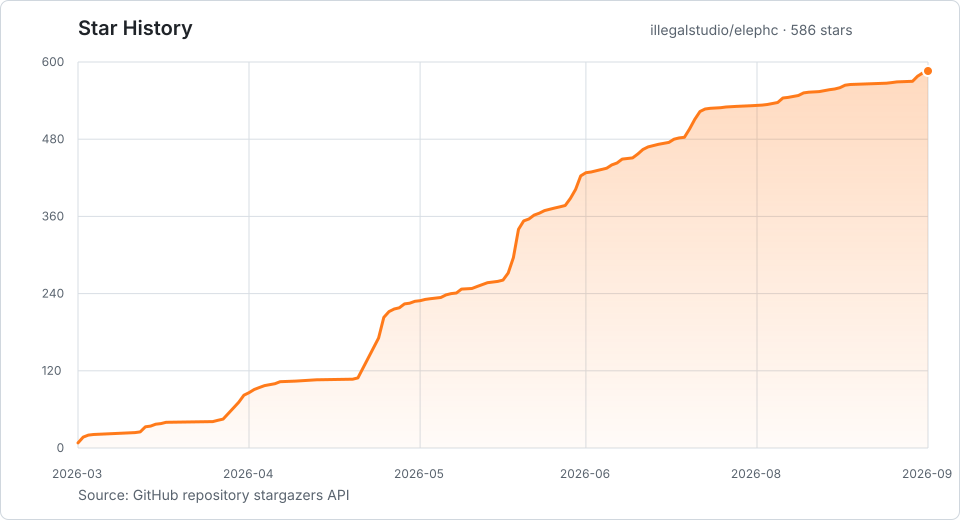

<p align="center">
  
</p>

<h1 align="center">Elephc</h1>

<p align="center">
  <sub><strong>Pronounced</strong> <em>el-ef-see</em> — just spell out &ldquo;LFC&rdquo;.</sub>
</p>

<p align="center">
  <em>Write PHP. Ship a native binary.</em>
</p>

<p align="center">
  <a href="https://github.com/illegalstudio/elephc/stargazers"></a>
  <a href="https://github.com/illegalstudio/elephc/releases"></a>
  <a href="https://github.com/illegalstudio/elephc"></a>
  <a href="LICENSE"></a>
  <a href="https://x.com/nahime0"></a>
</p>

<p align="center">
  <strong>5 compile targets &middot; 3 release hosts &middot; no Zend Engine &middot; no external PHP runtime</strong>
</p>

<p align="center">
  A PHP-to-native compiler that takes a subset of PHP and compiles it directly to native assembly. Standalone executables and compiler release archives target <strong>macOS ARM64</strong>, <strong>Linux ARM64</strong>, and <strong>Linux x86_64</strong>; a macOS host also cross-compiles libraries for <strong>iOS ARM64</strong> devices and the <strong>iOS ARM64 Simulator</strong>. Ordinary source is AOT-compiled with no opcode fallback; experimental <code>eval()</code> can embed an optional interpreter bridge when runtime parsing is required.
</p>

<p align="center">
  <a href="https://elephc.dev"><strong>Official Website</strong></a>
</p>

---

## Support the project

elephc is built and maintained independently. You can support the project by either:

- 🐦 **[Following me on X (@nahime0)](https://x.com/nahime0)** for updates, new features, and behind-the-scenes development.
- ⭐ **[Starring the repo](https://github.com/illegalstudio/elephc/stargazers)** — it helps others discover it and keeps the project going.
- 💜 **[Sponsoring on GitHub](https://github.com/sponsors/nahime0)** — every contribution, big or small, makes a real difference.

## Core Contributors

<p>
  <a href="https://github.com/nahime0"></a>
  &nbsp;<a href="https://github.com/nahime0"><b>Vincenzo Petrucci</b></a>
</p>

<p>
  <a href="https://github.com/Guikingone"></a>
  &nbsp;<a href="https://github.com/Guikingone"><b>Guillaume Loulier</b></a>
</p>

## An async HTTP server in PHP

An asynchronous HTTP/1.1 server — a non-blocking `poll()` event loop, one Fiber per connection, raw TCP sockets through `extern` FFI, plus an HTTP parser and a router — written entirely in PHP and compiled to a single native binary. No interpreter, no PHP-FPM, no Nginx.


See [showcases/http-server/](showcases/http-server/) for full source and build instructions.

## DOOM rendered in PHP

The flagship showcase: a real-time 3D renderer that loads original DOOM WAD files and renders E1M1 — BSP traversal, perspective projection, per-column fog, sector lighting, collision detection, step climbing — entirely in PHP compiled to a native binary.



See [showcases/doom/](showcases/doom/) for full source and build instructions.

## Why

My first "serious programming" book was *PHP 4 and MySQL*. After years of experimenting with code, that book turned my passion into a profession. I've worked with many languages over the past 20 years, but PHP is the one that has most consistently put food on the table.

PHP has a simple, approachable, and elegant syntax. Millions of developers worldwide already know it well. That makes it an ideal bridge to bring web developers closer to lower-level programming — systems work, native binaries, understanding what happens under the hood — without forcing them to learn an entirely new language first.

One thing I always missed about PHP was the ability to produce optimized, fast native binaries. While everyone else is busy building the next Facebook, I thought I could try to fill that gap and write a compiler for PHP.

Of course, PHP has its limits when it comes to performance-critical or systems-level work. That's why elephc introduces compiler extensions like `packed class` for flat POD records, `buffer<T>` for contiguous typed arrays, `ptr` for raw memory access, and `extern` for FFI — constructs that give PHP developers the tools they need without abandoning the language they already know.

It's not perfect, but **it works** — and it has grown into a genuinely capable PHP compiler. It also happens to be a great way to understand **how a compiler works** and how assembly language operates under the hood.

I made the project as modular as possible. Every function has its own codegen file, and each one is **commented line by line**, so you can see exactly how a high-level construct gets translated into its low-level equivalent.

## What you can expect

You can write PHP using the constructs documented in the [docs](docs/). Classes with single inheritance, interfaces, `instanceof`, nullsafe access (`?->`), abstract classes, final classes, methods and typed/static properties, PHP-style static property redeclarations, constructor property promotion, traits, constructors, instance/static methods, case-insensitive PHP symbol lookup for functions/classes/methods, `self::` / `parent::` / `static::` with late static binding, `readonly` properties and classes, enums, PHP 8 attributes on declarations, named arguments, first-class callables, typed function and method parameters and returns, `try` / `catch` / `finally` / `throw`, visibility modifiers, union and nullable types, copy-on-write arrays, associative arrays with PHP insertion order and integer/numeric-string key normalization, array union with `+`, closures, generator functions and generator closures with `yield` / `yield from`, namespaces, includes, compile-time Composer/SPL autoloading, class/introspection helpers, `PDO` database access (`PDO` / `PDOStatement` / `PDOException`) with SQLite, PostgreSQL, MySQL/MariaDB, and optional DBLIB, Firebird, ODBC, Informix, IBM, SQLSRV, and Oracle drivers, image creation and manipulation (GD raster I/O, drawing, transforms/filters, Exif/IPTC metadata, and the `Imagick`/`Gmagick`/Cairo object APIs) on a pure-Rust codec/raster bridge, and PHP 8.1-style `Fiber` coroutines on the three executable/release hosts: macOS ARM64, Linux ARM64, and Linux x86_64. The iOS compile targets are library-only and do not run Fibers.

Experimental [`eval()` support](docs/php/eval.md) AOT-lowers eligible literal fragments and falls back to the optional, statically linked Magician interpreter for dynamic fragments. Runnable examples live in [`examples/eval/`](examples/eval/), [`examples/eval-globals/`](examples/eval-globals/), and the opt-in regex example [`examples/eval_regex/`](examples/eval_regex/).

For performance-oriented code, elephc exposes compiler extensions beyond standard PHP — see the Why section above.

Then compile and run:

```bash
elephc myfile.php
./myfile
```

elephc also accepts tagless `.lfc` source. The whole file is code, so it has no
`<?php` / `?>` tags and never emits plain text implicitly:

```text
echo "Hello from LFC!\n";
```

```bash
elephc hello.lfc
./hello
```

LFC files always expose elephc extensions. In mixed projects, `--strict-php`
still audits every physical `.php` file while included or autoloaded `.lfc`
files keep their extension-enabled profile. See
[LFC source files](docs/beyond-php/lfc-source-files.md).

Compiled programs profile at the PHP level, with **one command that does not
change with the environment**. Build with `--with-monitoring` and `elephc
monitor` reads the binary you ran, or the service already serving traffic at
`https://host:9411`.

A program you *launch* is measured from inside: exact wall time, allocations,
retained objects, database wait, SQL queries, outgoing network operations and
network wait, plus call counts, rooted at `{main}`, so an N+1 is a certainty
rather than a suspicion. Curl requests also propagate the active W3C
`traceparent` unless user code supplied one. File I/O is not yet counted or
timed. A service you *connect to* answers from its sample ring by
default — sampled CPU-time shares, sampled allocation attribution and route
tags, with no blocked wall time or query/wait summary in a combined monitoring
build — and `elephc monitor
<addr> --exact` returns the measured per-function table for one completed request,
which is the same kind of answer a laptop run gives. A `--web` service also
answers a signed `X-Elephc-Query` header, which measures that one request exactly
and leaves the rest untouched. The capability
is dormant until asked, and asking takes the build key — a control channel for a
program you launch, a mutual handshake for one you connect to, a signed
`X-Elephc-Query` header for a single production request. A project's performance
budget lives in a `.elephc` file and fails the build when it is exceeded, and
every profile carries a W3C Trace Context identity, so it joins whatever
distributed trace its caller already belongs to. See
[Profiling](docs/beyond-php/profiling.md).

The compiler is experimental and evolving. Not everything PHP supports is implemented, and you will find bugs. But as the DOOM showcase demonstrates, you can build real, non-trivial programs with it today.

If you want to contribute, you're welcome. Mi casa es tu casa.

## Learn how a compiler works

elephc is designed to be read. The code generation and runtime layers are heavily annotated, so you can see what each lowering step and emitted instruction is doing — from stack frame setup to syscall invocation, from integer-to-string conversion to array memory layout. If you've ever wondered what happens between `echo "hello"` and the CPU executing it, follow the code from `src/codegen/` and read the comments. **No prior assembly knowledge required.**

## How elephc is different

There are several ways to make PHP easier to distribute or faster to run: bundling a PHP runtime into one executable, encrypting bytecode, running through the Zend VM with JIT, or compiling selected hot paths while falling back to opcodes for dynamic code.

elephc takes a narrower but cleaner route: it is a from-scratch compiler for a static subset of PHP. It parses PHP source, type-checks it, lowers it to target-specific assembly, assembles and links it into a native executable, and ships only the small runtime routines needed by the generated program. Ordinary supported constructs are native code. Eligible literal `eval()` fragments can also be lowered ahead of time; fragments that require runtime parsing use the optional Magician interpreter bridge.

That tradeoff is intentional:

- **Less long-tail compatibility** than a VM-backed PHP implementation.
- **More mechanical transparency**: readable assembly output, source maps, line-by-line commented codegen, and a documented memory model.
- **No hidden external PHP runtime dependency**: the generated binary does not need PHP, the Zend Engine, or a loader extension. A program that needs dynamic `eval()` embeds its optional interpreter bridge directly in the standalone binary.
- **Native-oriented extensions**: `extern`, `ptr`, `buffer<T>`, and `packed class` let PHP-shaped code cross into systems, FFI, game, and performance-sensitive workloads.

That does not mean elephc has to live outside the existing PHP ecosystem. The current CLI path produces standalone executables, shared libraries (`--emit cdylib`), and static libraries (`--emit staticlib`; `--emit lib` is an alias), while the roadmap includes an experimental PHP extension bridge. That opens a practical middle path: keep a framework such as WordPress, Laravel, or Symfony running on PHP, then compile static, performance-sensitive modules into native libraries or PHP extensions.

So elephc is not a drop-in replacement for an entire dynamic framework today. The longer-term goal is more useful: make it possible to move the parts of PHP code that are static enough to compile into inspectable native code, while the rest of the application can stay in ordinary PHP.

## Requirements

- Rust toolchain (`cargo`) only when building elephc from source
- A native assembler and linker for your host/target
- On macOS: Xcode Command Line Tools (`xcode-select --install`)
- On Linux: a standard native toolchain (`as`, `ld`, libc development files)
- To install curated native packages: a POSIX shell, Make, target `cc`, `ar`, and `ranlib`

Native packages such as PCRE2 are built from Elephc's pinned catalog; a system
PCRE2 package is not a production prerequisite.

## Install

### elvm (recommended)

[`elvm`](https://github.com/getelephc/elvm) installs elephc versions side by
side and selects the right compiler through a project or global version. Install
the version manager first:

```bash
curl -fsSL https://get.elephc.dev | sh
```

The installer prompts to add `~/.elvm/bin` to your `PATH`; start a new shell
after accepting. It installs `elvm` itself, not a compiler version. Install the
latest elephc release and make it the default with:

```bash
elvm install latest
elvm use latest --global
elvm current
```

To pin a project to a specific compiler, install that version and select it in
the project directory:

```bash
elvm install 0.26.5
elvm use 0.26.5
```

The second command writes `.elephc-version`. Commit that file so contributors
and CI can install the same compiler with `elvm install`. See the
[installation guide](docs/getting-started/installation.md) for version
selection and troubleshooting.

### Homebrew (alternative, macOS)

```bash
brew install illegalstudio/tap/elephc
```

### Nightly builds

`main` is built nightly and published as a pre-release under the rolling
[`nightly`](https://github.com/illegalstudio/elephc/releases/tag/nightly) tag.
Each successful build also receives an immutable `nightly-YYYYMMDD` tag, with
numbered suffixes for same-day rebuilds and retention of the 14 newest dated
builds. Nightlies are unsupported; see the
[installation guide](docs/getting-started/installation.md#nightly-builds-unsupported).

### From source (alternative)

```bash
git clone https://github.com/illegalstudio/elephc.git
cd elephc
cargo build --release
```

The binary is at `./target/release/elephc`.

### Manual download (alternative)

Pre-built compiler binaries are available on the [Releases](https://github.com/illegalstudio/elephc/releases) page. Every release ships per-host-platform tarballs — `elephc-<version>-aarch64-apple-darwin.tar.gz`, `elephc-<version>-x86_64-unknown-linux-gnu.tar.gz`, and `elephc-<version>-aarch64-unknown-linux-gnu.tar.gz` — each bundling the compiler and its bridge staticlibs; the Linux builds target glibc 2.35 or newer. These archives describe where the compiler runs, not its output target matrix: iOS libraries are cross-compiled from the macOS host. If macOS blocks the binary, run:

```bash
xattr -cr elephc
```

## Usage

> **Important:** elephc lowers every build through the EIR pipeline and the
> target-aware assembly emitter.

```bash
# Compile tagged PHP or tagless LFC source to a native binary
elephc hello.php
./hello
elephc hello.lfc

# Print the compiler version
elephc --version
elephc -V

# Custom heap size (default: 8MB)
elephc --heap-size=16777216 heavy.php

# Enable runtime heap verification while debugging ownership issues
elephc --heap-debug heavy.php

# Print allocation/free counters to stderr while debugging GC behavior
elephc --gc-stats heavy.php

# Profile a program at the PHP level: bar table on stdout (runtime helper time
# translated to causes like heap allocation or Mixed cell boxing), Speedscope
# profile on disk, inlined calls recovered as virtual frames (macOS)
elephc monitor hot.php

# Top-style live view of a running program and its worker children. Reads the
# process from the outside, so build it with --keep-symbols and allow tracing
elephc monitor --attach <pid> --live

# Embed the profiling capability (dormant until asked); the .key sidecar it
# writes lets `elephc monitor <host:port>` profile the service in production
elephc --with-monitoring app.php

# Embed exact per-function call counters (printed to stderr at exit)
elephc --counters app.php

# Enable compile-time feature branches
elephc --define DEBUG app.php

# Reject elephc extensions in every physical PHP file (.lfc stays extension-enabled)
elephc --strict-php app.php

# Make an incompatible local retype a compile error instead of a warning
elephc --strict-locals app.php

# Print per-phase compiler timings
elephc --timings hello.php

# Emit assembly and a simple source-map sidecar
elephc --emit-asm --source-map hello.php

# Run the front-end checks without writing assembly or a binary
elephc --check hello.php

# Fall back to stack-only value placement (default is linear-scan registers)
elephc --regalloc=stack hot.php

# Disable the EIR optimization passes (identity folding, peepholes, dead instruction elimination, …) for A/B comparison
elephc --no-ir-opt hot.php

# Link extra native libraries or frameworks for FFI
elephc app.php -l sqlite3 -L /opt/homebrew/lib --framework Cocoa

# Force-enable an optional bridge (pdo, mysqli, tls, crypto, bcmath, iconv, phar, tz, image, eval, regex, curl, web)
elephc app.php --with-pdo --with-crypto
# Force-inject the mysqli surface (links the shared elephc_pdo bridge, without the PDO classes)
elephc app.php --with-mysqli
# --with-eval force-links Magician; normal eval use is detected automatically
elephc app.php --with-eval

# Build a shared library exporting #[Export] functions instead of an executable
elephc --emit cdylib module.php

# Pin the PHP compatibility profile and silence non-error output
elephc --php-version 8.3 --quiet app.php

# Declare, lock, and install the managed PCRE2 package for a regex project
elephc native add pcre2
elephc regex.php
# Dynamic eval source needs the explicit regex capability
elephc --with-regex eval_regex.php

# Reproduce committed native state in CI (add --offline when already cached)
elephc native install --locked

# Explicit target selection
# Supported targets today: macos-aarch64, ios-arm64, ios-sim-arm64,
# linux-aarch64, linux-x86_64
elephc --target ios-arm64 --emit staticlib module.php
elephc --target ios-sim-arm64 --emit staticlib module.php
elephc --target linux-aarch64 hello.php
elephc --target linux-x86_64 hello.php

# Compile a standalone prefork HTTP server binary
elephc --web app.php                          # fastest; trusted application code
elephc --web --web-isolation=pool app.php     # crash containment + concurrent handlers
elephc --web --web-isolation=request app.php  # discard all native state after each request
./app --listen 127.0.0.1:8080
./app --listen 0.0.0.0:8080 --workers 4
```

For the smallest regex first run:

```bash
cd examples/hello-preg
elephc native add pcre2
elephc main.php
./main
```

`elephc native` manages a small, runtime/builtin-oriented catalog of verified C
sources: PCRE2 10.47, zlib 1.3.2, OpenSSL 3.5.8, nghttp2 1.70.0, libssh2 1.11.1,
and curl 8.21.0. Adding curl declares and links its complete pinned dependency
closure. This is intentionally **not** the mechanism used for Composer packages,
Rust bridge crates, compilers/SDKs, or arbitrary FFI libraries:

| Need | Mechanism |
|---|---|
| Curated runtime/builtin C package | `elephc native` + `elephc.toml`/`elephc.lock` |
| PHP source dependency | Composer + Elephc's compile-time autoloader |
| Optional Rust implementation | Auto-detected bridge or `--with-<crate>` |
| Compiler, SDK, Make, cross tools | Install and configure the toolchain yourself |

The DOOM and SDL examples are user FFI workflows; SDL is **not** installed,
locked, or satisfied by `elephc native`; they use `extern` plus
`--link`/`--link-path`/`--framework`. Ordinary compilation never downloads or
builds a native package. See [Native
dependencies](docs/compiling/native-dependencies.md).

Or via cargo:

```bash
cargo run -- hello.php
./hello
```

## Showcases

| Showcase | Description |
|---|---|
| [HTTP server](showcases/http-server/) | Async HTTP/1.1 server with a non-blocking `poll()` event loop, one `Fiber` per connection, POSIX sockets via `extern` FFI, `ptr` buffers, HTTP parser and router |
| [DOOM E1M1](showcases/doom/) | Real-time 3D WAD renderer with BSP traversal, SDL2 FFI, `packed class` geometry, `buffer<T>` storage, collision detection, HUD |
| [SDL framebuffer](examples/sdl_framebuffer/) | Pixel-level rendering with SDL2 via FFI |
| [SDL audio](examples/sdl_audio/) | Audio playback with SDL2 via FFI |
| [Hot-path buffers](examples/hot-path/) | `packed class` + `buffer<T>` for performance-critical data |
| [FFI memory](examples/ffi-memory/) | Raw C memory patterns with `malloc`, `free`, `memcpy` via FFI |

## FFI

elephc can call native C functions directly through `extern` declarations.

```php
<?php
extern function atoi(string $s): int;
extern function signal(int $sig, callable $handler): ptr;
extern function raise(int $sig): int;
extern global ptr $environ;

function on_signal($sig) {
    echo "signal = " . $sig . "\n";
}

echo atoi("999") . "\n";
echo ptr_is_null($environ) ? "missing\n" : "ok\n";
signal(15, "on_signal");
raise(15);
```

Notes:

- `extern function`, `extern "lib" { ... }`, `extern global`, and `extern class` are supported.
- `string` arguments are copied to temporary null-terminated C strings for the duration of the native call.
- `string` return values are copied back into owned elephc strings.
- `callable` parameters pass a user-defined elephc function by string name, for example `"on_signal"`.
- Callback functions must stay C-compatible: use `int`, `float`, `bool`, `ptr`, or `void`-shaped values. String callbacks are not supported yet.
- Raw C memory patterns are supported through ordinary extern declarations such as `malloc`, `free`, `memcpy`, and `memset`.
- Pointer helpers include sized buffer access (`ptr_read8`/`ptr_read16`/`ptr_read32`, `ptr_write8`/`ptr_write16`/`ptr_write32`, `ptr_read_string`/`ptr_write_string`) in addition to `ptr_get` / `ptr_set`.

## What it compiles

elephc supports a growing subset of PHP and aims to match PHP behavior for the language features it implements.

```php
<?php
$pi = M_PI;
echo "Pi is approximately " . number_format($pi, 5) . "\n";
echo "2 ** 10 = " . (2 ** 10) . "\n";
echo "10 / 3 = " . (10 / 3) . "\n";
echo "Type: " . gettype($pi) . "\n";

$x = (int)$pi;
echo "Truncated: " . $x . "\n";

if ($x === 3) {
    echo "Correct!\n";
}
```

### Supported types

elephc covers PHP's scalar, compound, and special types, plus compiler-specific types like `pointer`, `buffer<T>`, and `packed class`.

<details>
<summary>Show the full type table</summary>

| Type | Example |
|---|---|
| `int` | `42`, `-7`, `0xFF`, `0755`, `0o755`, `0b1010`, `1_000_000`, `PHP_INT_MAX` |
| `float` | `3.14`, `.5`, `1e-5`, `1_000.5`, `1e1_0`, `INF`, `NAN` |
| `string` | `"hello\n"`, `'raw'` |
| `bool` | `true`, `false` |
| `null` | `null` |
| `void` | `function log_it(): void { echo "ok"; }` |
| `never` | `function fail(): never { throw new Exception("boom"); }` |
| `mixed` | `mixed $x = 42;`, `function show(mixed $x): string { ... }` |
| `iterable` | `function walk(iterable $items): iterable { ... }` (PHP `array \| Traversable` pseudo-type; accepts indexed arrays, associative arrays, `Iterator`, and `IteratorAggregate`) |
| `resource` | Successful `$f = fopen("file.txt", "r")`, `STDIN`, `STDOUT`, `STDERR` |
| `callable` | `function apply(callable $fn): int { return $fn(); }` |
| `array` | `[1, 2, 3]`, `["key" => "value"]`, `[[1,2],[3,4]]` (indexed, associative, multi-dimensional, copy-on-write, union with `+`) |
| `object` | `new Foo()`, `$user->name` |
| `pointer` | `ptr($x)`, `ptr_null()`, `ptr_cast<int>($p)` |
| `enum` | `enum Color: int { case Red = 1; }`, `Color::Red->value`, `Color::from(1)` |
| `int\|string` | `int\|string $x = 42;`, `function show(int\|string $x): string { ... }` |
| `?int` | `?int $x = null;`, `function find(): ?int { ... }` |
| `buffer<T>` | `buffer<int> $xs = buffer_new<int>(256)` |
| `packed class` | `packed class Vec2 { public float $x; public float $y; }` |

</details>

### Supported constructs

The full list of supported constructs, operators, and control structures is in the [docs](docs/). Highlights:

<details>
<summary>Show the construct highlights</summary>

- **OOP**: classes, abstract/final classes, typed/final/static properties and methods, PHP-style static property redeclarations, direct static array property writes, constructor property promotion, interfaces, `instanceof`, traits, enums, PHP 8 declaration attributes, limited attribute reflection (`ReflectionClass`/`ReflectionMethod`/`ReflectionProperty::getAttributes()`, `ReflectionAttribute::newInstance()`), `readonly`, static/instance methods, case-insensitive class/interface/trait and method lookup, `self::`/`parent::`/`static::`, `::class` reflection (including `$object::class` on object expressions, returning the receiver's runtime class), class constants including PHP 8.3 typed class constants (exposed via `ReflectionClassConstant::hasType()`/`getType()`), `new self()` / `new static()` / `new parent()`, magic methods (`__toString`, `__get`, `__set`, `__isset`, `__unset`, `__call`, `__invoke`, `__clone`, `__destruct`), `clone`, `get_object_vars()` and `(array)` casts on objects
- **Functions**: case-insensitive user and built-in function calls, default parameters, variadic/spread, pass by reference, named arguments, global variables, static locals, first-class callables, closures, arrow functions, static closures (`static function () { }`, `static fn () => ...`)
- **Generators**: generator functions and closures, `yield`, key/value yields, `yield from`, `Generator::send()`, `throw()`, `getReturn()`, and `foreach` over `Iterator` / `IteratorAggregate`
- **Fibers**: `Fiber`, `FiberError`, `Fiber::suspend()`, `Fiber::getCurrent()`, `start()`, `resume()`, `throw()`, `getReturn()`, state predicates, closure captures, guarded native stacks, and target-aware context switching on the three executable/release hosts (macOS ARM64, Linux ARM64, and Linux x86_64); the iOS compile targets are library-only and do not run Fibers
- **Control flow**: if/elseif/else, while, do-while, for, foreach, switch, match, break/continue including multi-level depths, try/catch/finally/throw
- **Statements and literals**: `const` / `define()` constants, `global` declarations, `static` locals (with or without an initializer), `print` expressions, list unpacking, PHP numeric literal forms, heredoc / nowdoc strings, `declare(strict_types=1)` (per-file strict parameter binding, exactly as in PHP) and `declare(ticks=...)` directives
- **Operators**: arithmetic, comparison, `instanceof`, logical, bitwise, ternary, null coalescing (`??`), PHP 8.5 pipe (`|>`), assignment expressions for local and stabilized non-local targets, null coalescing assignment (`??=`), error control (`@`), and compound assignments
- **Types**: union types (`int|string`), nullable (`?int`), `never` return type, `iterable` pseudo-type, inferred `resource|false` values for `fopen()` and `resource` values for standard streams, type casting, typed properties, typed function, method, closure, and arrow parameters and returns
- **Modules**: namespaces, use imports, include/require/include_once/require_once, compile-time Composer PSR-4/PSR-0/classmap/files autoloading, `spl_autoload_register()` rule extraction, PHP magic constants
- **FFI**: extern functions, extern blocks, extern globals, extern classes, pointer builtins
- **Database (PDO)**: `PDO`, `PDOStatement`, `PDOException` with SQLite, PostgreSQL, MySQL/MariaDB, optional FreeTDS PDO_DBLIB, pure-Rust PDO_FIREBIRD, system-driver-manager PDO_ODBC, Client SDK PDO_INFORMIX/PDO_IBM, Microsoft ODBC PDO_SQLSRV, Oracle Instant Client PDO_OCI, and official CCI PDO_CUBRID drivers, positional `?` and named `:name` binds, fetch modes, transactions, and `foreach` over result sets
- **Database (mysqli)**: a documented `mysqli` / `mysqli_stmt` / `mysqli_result` subset for MySQL/MariaDB over the same pure-Rust client — buffered independent results, prepared statements, `multi_query`, `mysqli_report` error modes, and the full procedural `mysqli_*` alias surface
- **Date/time**: `DateTime`, `DateTimeImmutable`, `DateTimeInterface`, `DateTimeZone`, `DateInterval`, `DatePeriod`, the PHP 8.3 date exception hierarchy, DST-aware formatting via a bundled IANA timezone database, and `ext/calendar` Julian-Day functions
- **Crypto**: `md5()`/`sha1()`/`hash()`/`hash_hmac()` hashing and OpenSSL-compatible symmetric ciphers (`openssl_encrypt()`/`openssl_decrypt()`, AES CBC/CTR/ECB/GCM) through a pure-Rust bridge with no system OpenSSL dependency
- **Native extensions**: complete `iconv` conversion and MIME helpers, plus the supported `curl` easy, multi, share, callback, stream, and multipart API through pay-for-use bridges
- **Web server (`--web`)**: standalone prefork HTTP server binaries with compile-time `worker` (default), persistent `pool`, or fork-per-`request` isolation; request superglobals and `php://input`; `header()`/`http_response_code()` response control; and PHP-compatible sessions — `$_SESSION`, the complete `session_*()` API, file persistence, custom save handlers, strict mode, cookies and cache limiters, and trans-SID rewriting
- **Extensions**: `ifdef`, `packed class`, `buffer<T>`, `buffer_new<T>()`, `buffer_len()`, `buffer_free()`

</details>

### Built-in functions (549)

The generated builtin documentation currently exposes 549 PHP-visible entries across arrays, buffers, class introspection, dates, filesystems, I/O, JSON, math/BCMath, process control, regex, SPL, streams, strings, types, and elephc's pointer extensions. The exhaustive list, signatures, availability, and implementation links are generated from the shared contract in [Built-in functions](docs/php/builtins.md); keeping one generated index avoids a second hand-maintained list drifting here.

### Constants

Standard PHP constants are predefined — math, JSON, file/glob/lock flags, the full `STREAM_*` family, and magic constants like `__DIR__` and `__LINE__`.

<details>
<summary>Show the built-in constant highlights</summary>

`INF`, `NAN`, `PHP_INT_MAX`, `PHP_INT_MIN`, `PHP_FLOAT_MAX`, `PHP_FLOAT_MIN`, `PHP_FLOAT_EPSILON`, `M_PI`, `M_E`, `M_SQRT2`, `M_PI_2`, `M_PI_4`, `M_LOG2E`, `M_LOG10E`, `PHP_EOL`, `PHP_OS`, `DIRECTORY_SEPARATOR`, `STDIN`, `STDOUT`, `STDERR`, `PATHINFO_DIRNAME`, `PATHINFO_BASENAME`, `PATHINFO_EXTENSION`, `PATHINFO_FILENAME`, `PATHINFO_ALL`, `PHP_URL_SCHEME`, `PHP_URL_HOST`, `PHP_URL_PORT`, `PHP_URL_USER`, `PHP_URL_PASS`, `PHP_URL_PATH`, `PHP_URL_QUERY`, `PHP_URL_FRAGMENT`, `FNM_NOESCAPE`, `FNM_PATHNAME`, `FNM_PERIOD`, `FNM_CASEFOLD`, `LOCK_SH`, `LOCK_EX`, `LOCK_UN`, `LOCK_NB`, `JSON_HEX_TAG`, `JSON_HEX_AMP`, `JSON_HEX_APOS`, `JSON_HEX_QUOT`, `JSON_FORCE_OBJECT`, `JSON_NUMERIC_CHECK`, `JSON_UNESCAPED_SLASHES`, `JSON_PRETTY_PRINT`, `JSON_UNESCAPED_UNICODE`, `JSON_PARTIAL_OUTPUT_ON_ERROR`, `JSON_PRESERVE_ZERO_FRACTION`, `JSON_INVALID_UTF8_IGNORE`, `JSON_INVALID_UTF8_SUBSTITUTE`, `JSON_THROW_ON_ERROR`, `JSON_OBJECT_AS_ARRAY`, `JSON_BIGINT_AS_STRING`, `JSON_ERROR_NONE`, `JSON_ERROR_DEPTH`, `JSON_ERROR_STATE_MISMATCH`, `JSON_ERROR_CTRL_CHAR`, `JSON_ERROR_SYNTAX`, `JSON_ERROR_UTF8`, `JSON_ERROR_RECURSION`, `JSON_ERROR_INF_OR_NAN`, `JSON_ERROR_UNSUPPORTED_TYPE`, `JSON_ERROR_INVALID_PROPERTY_NAME`, `JSON_ERROR_UTF16`, `ARRAY_FILTER_USE_VALUE`, `ARRAY_FILTER_USE_KEY`, `ARRAY_FILTER_USE_BOTH`, `FILE_USE_INCLUDE_PATH`, `FILE_APPEND`, `FILE_NO_DEFAULT_CONTEXT`, `FILE_IGNORE_NEW_LINES`, `FILE_SKIP_EMPTY_LINES`, `GLOB_BRACE`, `GLOB_ERR`, `GLOB_MARK`, `GLOB_NOCHECK`, `GLOB_NOESCAPE`, `GLOB_NOSORT`, `GLOB_ONLYDIR`, the `STREAM_*` family (`STREAM_CLIENT_*`, `STREAM_SERVER_*`, `STREAM_CRYPTO_METHOD_*`, `STREAM_SHUT_*`, `STREAM_PF_*`, `STREAM_SOCK_*`, `STREAM_IPPROTO_*`, `STREAM_NOTIFY_*`, `STREAM_META_*`, `STREAM_FILTER_*`, `STREAM_OPTION_*`, `STREAM_BUFFER_*`, `STREAM_CAST_*`, `STREAM_URL_STAT_*`, plus `STREAM_USE_PATH` / `STREAM_IGNORE_URL` / `STREAM_IS_URL` / `STREAM_REPORT_ERRORS` / `STREAM_MUST_SEEK` / `STREAM_MKDIR_RECURSIVE` / `STREAM_OOB` / `STREAM_PEEK`), the `PSFS_*` stream-filter constants (`PSFS_PASS_ON`, `PSFS_FEED_ME`, `PSFS_ERR_FATAL`, `PSFS_FLAG_NORMAL`, `PSFS_FLAG_FLUSH_INC`, `PSFS_FLAG_FLUSH_CLOSE`), `__DIR__`, `__FILE__`, `__LINE__`, `__FUNCTION__`, `__CLASS__`, `__METHOD__`, `__NAMESPACE__`, `__TRAIT__` — plus the `E_*`, `ENT_*`, `PREG_*`, `STR_PAD_*`, `COUNT_*`, `PHP_ROUND_HALF_*`, `PHP_SESSION_*`, `OPENSSL_*`, `CAL_*`, `SUNFUNCS_*`, and `MYSQLI_*` families and the `PHP_VERSION` / `PHP_SAPI` version constants

</details>

User-defined constants are also supported via `const NAME = value;` and `define("NAME", value);`. Constants remain case-sensitive, matching PHP.

## How it works

```
Physical source (`.php` or `.lfc`) → source classification → Lexer → Parser (AST) → Magic constants (per-file) → strict-PHP audit (PHP files only) → Conditional (ifdef/--define) → Autoload registry build (Composer + SPL rules) → Resolver (include declaration discovery, include/require inlining, per-file constants, once guards, function variant marks) → NameResolver (namespaces/use/FQNs) → Autoload run (class-triggered file insertion) → function-argument introspection desugaring → OPcache manifest bake → Optimizer (constant folding) → Type Checker → Optimizer (constant propagation) → Optimizer (control-flow pruning) → Optimizer (control-flow normalization) → Optimizer (dead-code elimination) → Optimizer (declaration reachability) → EIR lowering + validation → fixed-point EIR optimization → register allocation → EIR codegen → assembly/source-map write → runtime cache → read-only native requirement resolution → typed link plan → as + ld → native executable
```

The compiler emits human-readable assembly for the selected target. You can inspect the `.s` file to see exactly what your PHP becomes:

```bash
elephc hello.php
cat hello.s
```

Linked executables are stripped of their symbol table, which is about a quarter of the file and which nothing reads at run time. Pass `--keep-symbols` when a profiler needs the names, or `--debug-info`, which keeps them as well as emitting DWARF:

```bash
elephc --keep-symbols hello.php
```

If you add `--source-map`, elephc also writes `hello.map`, a compact JSON sidecar that maps emitted assembly lines back to PHP line/column pairs. If you add `--timings`, the compiler prints per-phase durations such as lexing, parsing, early optimization, type checking, constant propagation, post-check pruning, control-flow normalization, dead-code elimination, declaration reachability, runtime-cache preparation, code generation, assembling, and linking.

### Current optimization passes

elephc already performs a small but useful AST-level optimization pipeline before emitting assembly:

- **Constant folding before type checking**: folds scalar arithmetic, bitwise ops, comparisons, logical ops, string-literal concatenation, scalar casts, ternaries, null coalescing, known `match` expressions, and scalar indexed/associative array-literal reads when the result is statically known.
- **Constant propagation after type checking**: forwards scalar local values through straight-line code, across agreeing `if` / `switch` / `try` merges, through known-subject `switch` paths, through non-throwing `try` bodies without poisoning the merge with unreachable catches, through uniform local `?:` / `match` assignments, through fixed scalar destructuring like `[$a, $b] = [2, 3]`, and across simple loops when untouched locals or stable `for` init assignments can be proven safe even with conservative nested `switch`, `try/catch/finally`, `foreach`, other simple nested loop writes, local array mutations like `$items[] = $i` / `$items[0] = $i`, local property writes like `$box->last = $i` / `$box->items[] = $i`, or targeted local invalidations like `unset($tmp)`. It also uses local loop path summaries for known `while(false)`, `do...while(false)`, `while(true)` / `for(;;)` break exits, and branch-local loop exits that agree on scalar values, which in turn unlocks more folding in later expressions such as `$x ** $y`.
- **Control-flow pruning after type checking**: removes constant-dead `if` / `elseif` / `while (false)` / `for (...; false; ...)` branches, materializes constant `switch` execution, prunes `match` arms, and trims unreachable statements after terminating constructs such as `return`, `throw`, `break`, and `continue`.
- **Control-flow normalization after pruning**: canonicalizes equivalent residual shapes such as nested `elseif` chains, merged `if` heads/tails, negated two-way `if` branches swapped onto the positive test, single-case or fallthrough-only `switch` shells, canonical multi-catch handlers, folded outer `finally` wrappers, and identical `if` branches so later passes see fewer structurally different but semantically identical trees. Loop shells are canonicalized too: `for` loops without an update clause become `while` loops, `do ... while (true)` becomes `while (true)`, leading `if (...) break;` guards fold into the loop test, an endless loop ending in a break guard rotates into `do ... while`, and redundant trailing `continue` / final-`switch`-body `break` / bare function `return;` terminators are dropped.
- **Dead-code elimination after normalization**: removes empty control shells, simplifies single-path conditionals, and prunes guard contradictions across boolean, strict-scalar, loose-equality, proven-integer range, and cross-variable relational checks. Exact `int` parameters and typed locals seed discrete ranges; strict relational substitution feeds the full exact/truthiness/switch model; and pure, non-throwing `while` / `for` conditions strengthen their body entry. The pass also uses CFG-lite reachability for local `if` / `switch` / `try` shapes, hoists safe non-throwing `try` prefixes, and drops unused pure expression statements and dead pure subexpressions when the surrounding expression already determines the result.
- **Whole-program declaration reachability after DCE**: removes unreachable functions, unused classes, and unused methods from user code and injected preludes before EIR lowering, while keeping `CheckResult` method/vtable metadata aligned. Dynamic calls, builtin callback parameters, `eval`, `unserialize`, and Reflection conservatively retain wider surfaces only when their containing body is executable; inherited and trait-flattened bodies follow checker ownership, while interface-required symbols remain structurally available without activating dormant dynamic branches. Prelude-producing `--with-pdo`, `--with-tz`, and `--with-image` root their injected groups; `--with-crypto` only force-links its bridge, and `--web` remains demand-pruned.
- **Local effect summaries for purity / may-throw reasoning**: tracks known pure and non-throwing builtins, user functions, static methods, private `$this` methods, closures, first-class callables, and merged callable aliases through `if` / `switch` / `try` control flow so the optimizer can simplify `try` regions and prune dead handlers more precisely.

The optimizer is intentionally conservative. It does not yet do full function-level CFG fixed-point propagation, aggressive whole-program optimization, or assembly-level peephole rewriting, but it does compute lightweight effect summaries and local CFG-lite reachability for known call targets and structured control flow so AST rewrites can stay more precise without becoming risky.

At the EIR level, the backend runs a fixed-point **optimization pass driver** (on by default, gated by `--ir-opt`): identity arithmetic folding (`x + 0`, `x * 1`, `x ^ x`, …), local peephole rewrites (box/unbox cancellation, scalar load/store forwarding, paired acquire/release cancellation, string-literal concat folding, and redundant `move` / `borrow` cleanup), per-block constant folding, dominance-aware common-subexpression elimination, loop-invariant code motion, CFG-aware dead instruction elimination for unused pure results, CFG-aware dead store elimination for scalar local writes that are never read before being overwritten, and branch simplification (folding constant-condition `cond_br` / `switch`, threading empty forwarding blocks, and removing unreachable blocks). A cross-function **small-function inliner** also splices small, non-recursive, destructor-free helpers into their callers, and the whole pipeline runs to a module-level fixed point so inlining and the per-function passes feed each other. Use `--no-ir-opt` to turn the passes off for A/B comparison.

It then runs a **linear-scan register allocator** (Poletto-Sarkar) with liveness analysis, live intervals, and separate integer/float register pools. Hot scalar values live in callee-saved registers across calls instead of being spilled to the stack on every use, which speeds up compute-heavy code substantially. Use `--regalloc=stack` to fall back to the original spill-everything placement.

### Type system

The static type system tracks these runtime shapes at compile time:

- **Int** — 64-bit signed integer
- **Float** — 64-bit double-precision
- **Str** — pointer + length pair
- **Bool** — `true`/`false`, coerces to 0/1
- **Void / null** — null sentinel value, coerces to 0/""
- **Never** — non-returning function/method/closure return type
- **Iterable** — type-erased array / `Traversable` pseudo-type
- **Array** — indexed arrays with inferred element type; heterogeneous payloads widen to boxed `Mixed`
- **AssocArray** — associative arrays with key/value types
- **Buffer** — fixed-size contiguous `buffer<T>` storage for hot-path values
- **Mixed** — boxed runtime-tagged payload used for heterogeneous array values, union storage, and user-facing `mixed` hints
- **Callable** — closures and callable function references
- **Object** — heap-allocated class instances
- **Packed** — nominal packed-record metadata used with pointers and buffers
- **Pointer** — raw 64-bit addresses, optionally tagged via `ptr_cast<T>()`
- **Resource** — stream handles such as successful `fopen()` results and standard streams
- **Union** — declared union types lowered to boxed tagged runtime payloads

The checker also carries the internal `False` subtype and the two-word `TaggedScalar` codegen shape used by the default tagged null representation.

A variable's type is set at first assignment. Compatible types (int/float/bool/null) can be reassigned between each other. An untyped local may also change type outright, in three shapes. `unset()` then reassign ENDS the binding — the name is unbound afterwards and the next assignment binds it fresh at any type, with no diagnostic in either mode. A straight-line reassignment and a branch-divergent assignment (boxed as `Mixed` storage) are a warning rather than an error by default, and `--strict-locals` makes those two an error again. A typed local, a type-hinted parameter, or a class property always stays strict. See [`--strict-locals`](docs/compiling/cli-reference.md#strict-locals-mode).

## Error messages

Errors include line and column numbers, and the compiler tries to recover far enough to report multiple independent syntax / semantic errors in one pass. Successful compilations may also emit non-fatal warnings such as unused variables / parameters or unreachable code:

```
error[3:1]: Undefined variable: $x
error[5:7]: Type error: cannot reassign $x from int to string
error[2:1]: Required file not found: 'missing.php'
warning[6:1]: $a changes type from int to string; the previous value is discarded (compile with --strict-locals to make this an error)
warning[9:5]: Unused variable: $tmp
warning[14:9]: Unreachable code
```

## Project structure

High-level map of the source tree. The codebase contains more focused helper submodules than shown here; treat this as an orientation guide rather than a byte-for-byte file listing.

<details>
<summary>Show the source tree</summary>

```
src/
├── lib.rs               # Public module exports
├── main.rs              # CLI binary entry point
├── cli.rs               # Command-line argument parsing and options
├── pipeline.rs          # Frontend/backend compilation pipeline
├── link_plan.rs         # Ordered typed archives/libraries and Linux link mode
├── link_planning.rs     # Compiler inputs to one final ordered link plan
├── linker/              # Assembler/linker rendering, bridges, SDK, archive handling
├── native_deps/         # Curated native CLI/catalog/cache/recipe/resolver
├── timings.rs           # Phase timing collection/reporting
├── span.rs              # Source position tracking (line, col)
├── conditional/         # Build-time `ifdef` pass driven by --define
├── magic_constants.rs   # Per-file PHP magic constant lowering
├── magic_constants/     # File/scope/trait magic-constant walkers
├── autoload/            # Composer/SPL AOT autoload indexing and file insertion
├── resolver/            # Include/require resolution, declaration discovery, once guards
├── eval_aot.rs          # Compile-time planning for literal eval AOT vs bridge fallback
├── runtime_cache.rs     # Preassembled runtime object cache
├── source_map.rs        # Assembly/source-map sidecar emission
├── monitor/             # Exact, sampled, local, remote, service, and export profiling
├── call_graph.rs        # Profiling call-graph aggregation and DOT/HTML rendering
├── pprof_encode.rs      # Profiling export in pprof protobuf form
├── probe_key.rs         # Monitoring build-key creation and validation
├── termination.rs       # Structured terminal-effect analysis
├── optimize.rs          # Optimizer public entry points and effect context
├── optimize/            # AST optimizer: folding, propagation, DCE, declaration reachability
├── names.rs             # Qualified/FQN name model + symbol mangling helpers
├── name_resolver/       # Namespace/use resolution to canonical names
├── pdo_prelude.rs       # PDO standard-library prelude (Rust-built AST) injection entry point
├── pdo_prelude/         # PDO driver detection, version gates, and driver subclasses
├── mysqli_prelude.rs    # mysqli surface over the PDO bridge: injection entry point
├── mysqli_prelude/      # mysqli class/procedural surface builders and usage detection
├── tz_prelude.rs        # Timezone-introspection prelude injection entry point
├── tz_prelude/          # Timezone-introspection prelude usage detection
├── list_id_prelude.rs   # DateTimeZone identifier-list prelude injection entry point
├── list_id_prelude/     # Identifier-list prelude detection and baked table data
├── var_export_prelude.rs # var_export prelude injection entry point
├── var_export_prelude/  # var_export prelude usage detection
│
├── lexer/               # Source text → token stream
│   ├── token.rs         # Token enum
│   ├── scan.rs          # Main scanning loop, operators
│   ├── literals.rs      # Literal scanning entry point
│   ├── literals/        # Identifier, number, and string scanners
│   └── cursor.rs        # Byte-level source reader
│
├── parser/              # Tokens → AST (Pratt parser)
│   ├── ast/             # ExprKind, StmtKind, BinOp, CastType
│   ├── expr/            # Expression parsing helpers and Pratt parser passes
│   ├── stmt/            # Statement parsing, OOP, namespaces, FFI
│   └── control.rs       # if, while, for, foreach, do-while, switch, try/catch/finally
│
├── types/               # Static type checking
│   ├── mod.rs           # check() entry point and type exports
│   ├── model.rs         # PhpType and TypeEnv
│   ├── result.rs        # CheckResult and semantic metadata
│   ├── signatures.rs    # Built-in and callable signatures
│   ├── call_args/       # Shared named/spread call planner
│   ├── schema.rs        # Class/interface/enum metadata
│   ├── fibers.rs        # Fiber callback validation
│   ├── traits.rs        # Trait flattening and conflict resolution
│   ├── traits/          # Trait expansion, merge, and validation helpers
│   ├── warnings/        # Non-fatal diagnostics (unused vars, unreachable code)
│   └── checker/
│       ├── mod.rs       # Type-checker orchestration
│       ├── builtin_interfaces.rs # Built-in SPL/core interface injection
│       ├── builtin_iterators.rs # Built-in Iterator / IteratorAggregate metadata
│       ├── builtin_json.rs # JsonException / JsonSerializable metadata
│       ├── builtin_spl_exceptions.rs # SPL exception hierarchy metadata
│       ├── builtin_stdclass.rs # stdClass dynamic-property metadata
│       ├── builtin_types/ # Built-in class/interface/enum metadata
│       ├── builtins/    # Checker-resident constructs and contextual builtin validation
│       ├── callables/   # Callable values, first-class callables, and callback checks
│       ├── driver/      # Checker initialization and orchestration helpers
│       ├── functions/   # User function type inference
│       ├── inference/   # Focused inference helpers
│       ├── schema/      # Class/interface/trait/enum schema validation
│       ├── stmt_check/  # Statement-level checking helpers
│       ├── type_compat/ # Type compatibility and assignment rules
│       └── yield_validation/ # Generator/yield placement validation
│
├── builtins/            # AOT builtin semantic home files bound to the shared catalog
├── ir/                  # EIR data model, builder, validator, and printer
├── ir_lower/            # Active AST → EIR lowering
├── ir_passes/           # EIR fixed-point optimization and register allocation
├── codegen/             # Active EIR → target assembly backend
│   ├── frame/           # Function frame analysis and placement
│   ├── lower_inst/      # Instruction, builtin, object, callable, and runtime lowering
│   └── runtime_metadata/ # Runtime feature and symbol metadata collected by codegen
├── codegen_support/     # Shared ABI/runtime/target helpers used by codegen
│   ├── abi/             # Target-aware calling-convention, frame, symbol, and value helpers
│   ├── platform/        # Target definitions and assembler/linker tooling
│   ├── program_usage/   # Required-class and program-usage analysis
│   ├── runtime/         # Shared target-aware __rt_* runtime emitters and data
│   ├── stream_filters/  # zlib/bzip2/iconv stream-filter attachment
│   └── wrappers/        # Callback and Fiber wrapper emitters
│
└── errors/              # Error formatting with line:col

crates/
├── elephc-builtin-contract/ # Dependency-neutral builtin catalog and signatures
├── elephc-bcmath/       # Exact arbitrary-precision decimal bridge
├── elephc-crypto/       # Hashing, HMAC, and OpenSSL-compatible crypto bridge
├── elephc-curl/         # Static libcurl easy, multi, share, callback, and multipart bridge
├── elephc-iconv/        # Character-set conversion and MIME header bridge
├── elephc-image/        # GD/Exif/Imagick/Gmagick/Cairo image bridge
├── elephc-instr/        # Exact profiling instrumentation runtime
├── elephc-magician/     # Optional EvalIR interpreter staticlib for dynamic eval
├── elephc-pdo/          # Multi-driver PDO bridge
├── elephc-phar/         # PHAR/tar/zip bridge
├── elephc-probe/        # Sampled profiling and authenticated service endpoint
├── elephc-tls/          # TLS stream bridge
├── elephc-tz/           # IANA timezone bridge
└── elephc-web/          # Prefork HTTP server bridge
```

</details>

## Tests

14,000+ Rust test cases across lexer, parser, codegen, runtime, and error reporting. Each codegen test compiles inline PHP source to a native binary, runs it, and asserts stdout.

```bash
cargo test                      # all tests
cargo test -- --include-ignored # all tests, including ignored integration tests
cargo test test_my_feature      # run specific tests
ELEPHC_PHP_CHECK=1 cargo test   # cross-check output with PHP interpreter
./scripts/test-linux-arm64.sh   # Linux ARM64 suite in Docker
./scripts/test-linux-x86_64.sh  # Linux x86_64 suite in Docker
```

## Documentation

The **[docs/](docs/)** directory is a complete wiki covering every aspect of the compiler. Inside you'll find:

- **PHP syntax reference**: types, operators, control structures, functions, classes, namespaces, and all 549 built-in functions with signatures and examples
- **Compiler extensions** — pointers, `buffer<T>`, `packed class`, FFI with `extern`, and conditional compilation with `ifdef` — the features that take PHP beyond the web
- **Compiler internals** — a step-by-step walkthrough of the full pipeline, from lexing to Pratt parsing to type checking to code generation and runtime structure
- **ARM64 primer** — an introduction to ARM64 assembly for people who've never seen it, plus a quick reference of the ARM64 instruction set used by elephc's AArch64 backend
- **Memory model** — how the stack, heap, concat buffer, and hash tables work under the hood

If you're new to compilers or assembly, start from the top and work your way down. No prior low-level knowledge required.

For runnable language samples, see `examples/`. For the benchmark harness and CI trend artifacts that compare elephc against PHP and equivalent C fixtures, see `benchmarks/README.md`. For a focused perf comparison, see `benchmarks/hot-path-buffer-vs-arrays`.

## License

MIT

## Resources

[](https://www.youtube.com/watch?v=x06307Ui3uY)

**[Nuno Maduro: PHP Is Getting a Compiler?](https://www.youtube.com/watch?v=x06307Ui3uY)**

## Star History

<picture>
  <source media="(prefers-color-scheme: dark)" srcset=".github/traffic/star-history-dark.svg" />
  
</picture>
