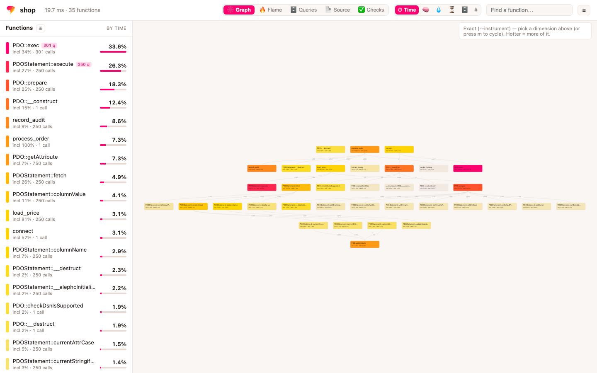
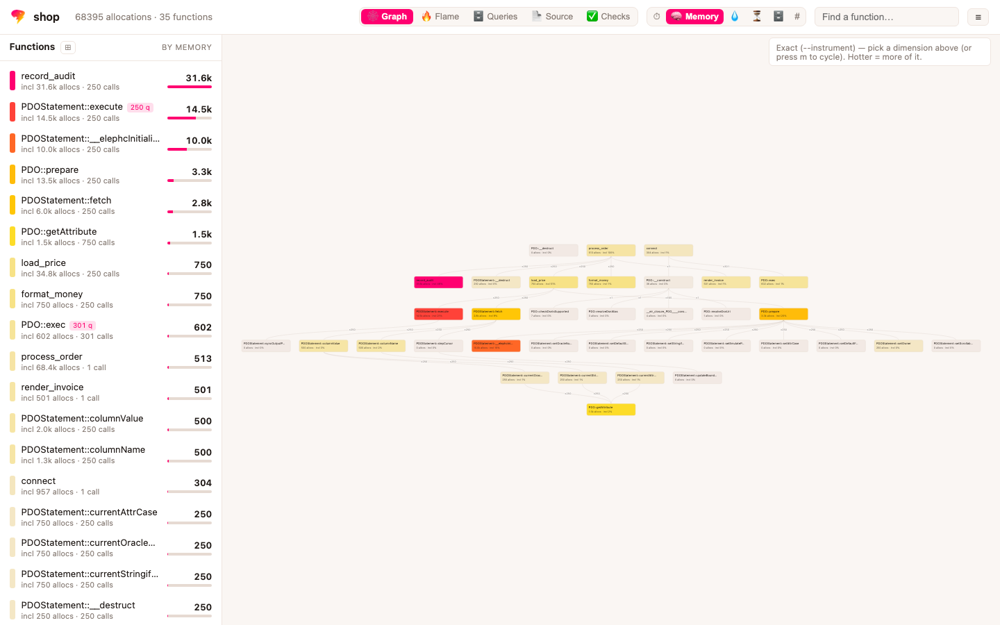
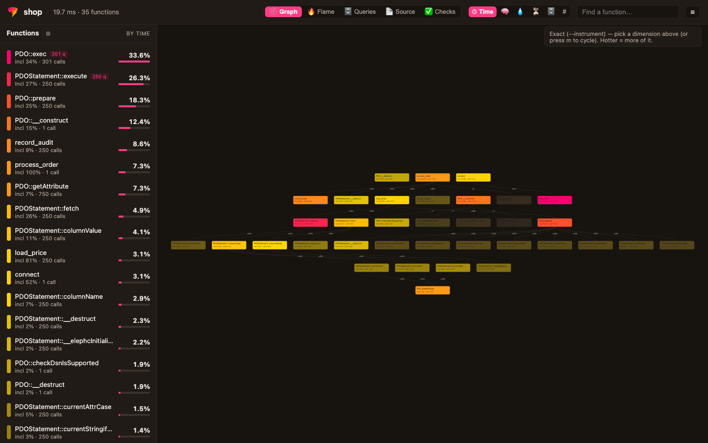
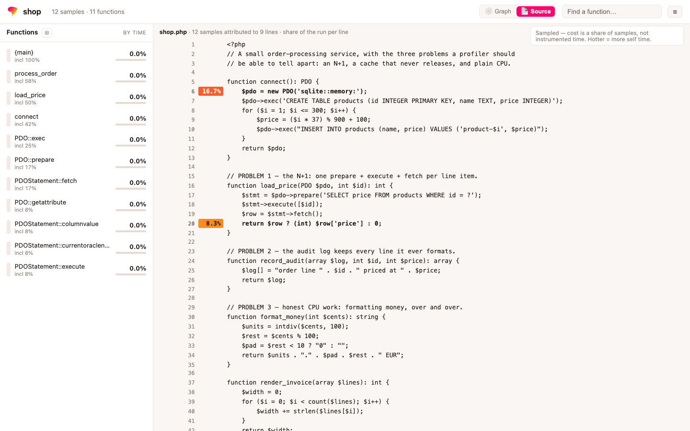
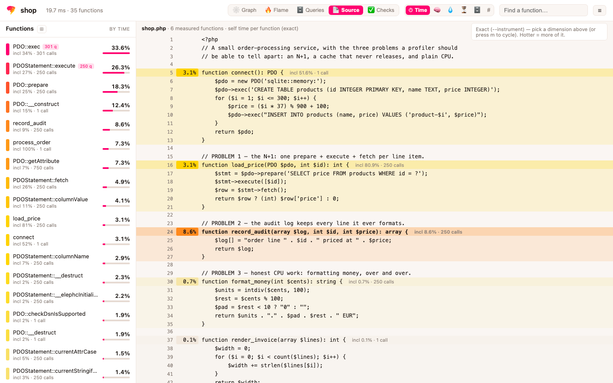
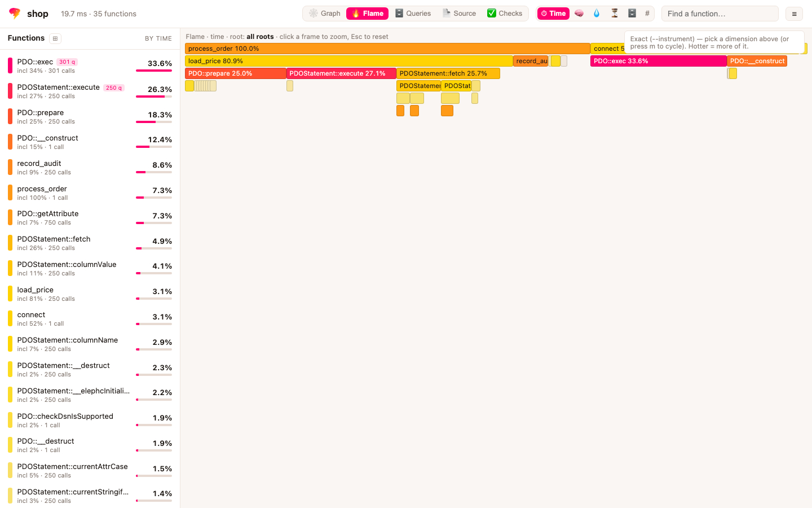
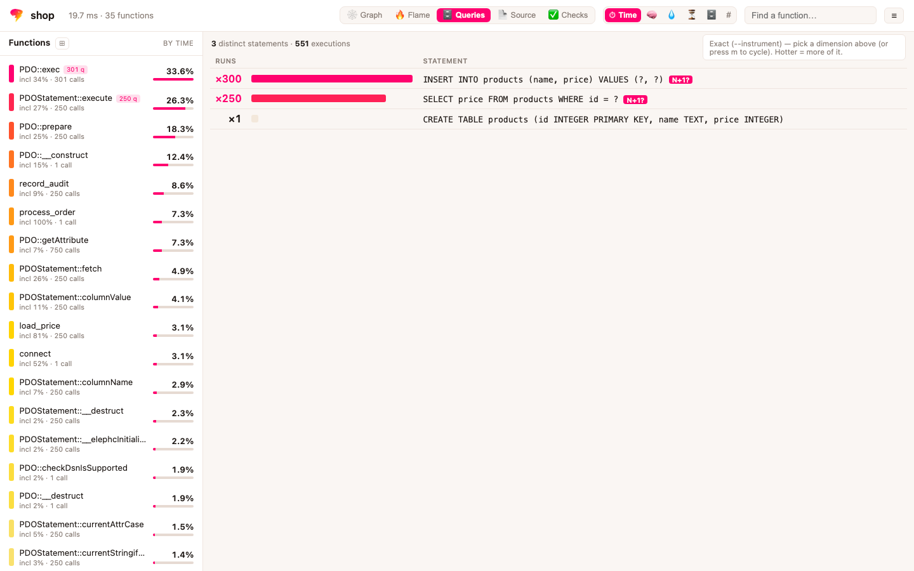
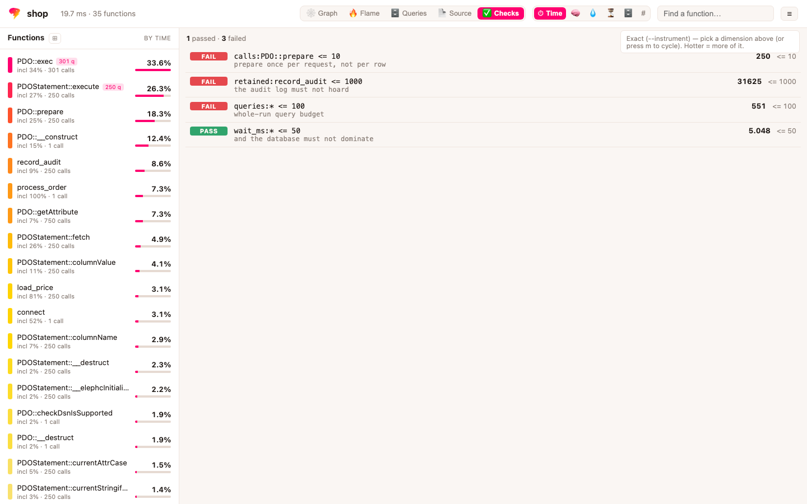
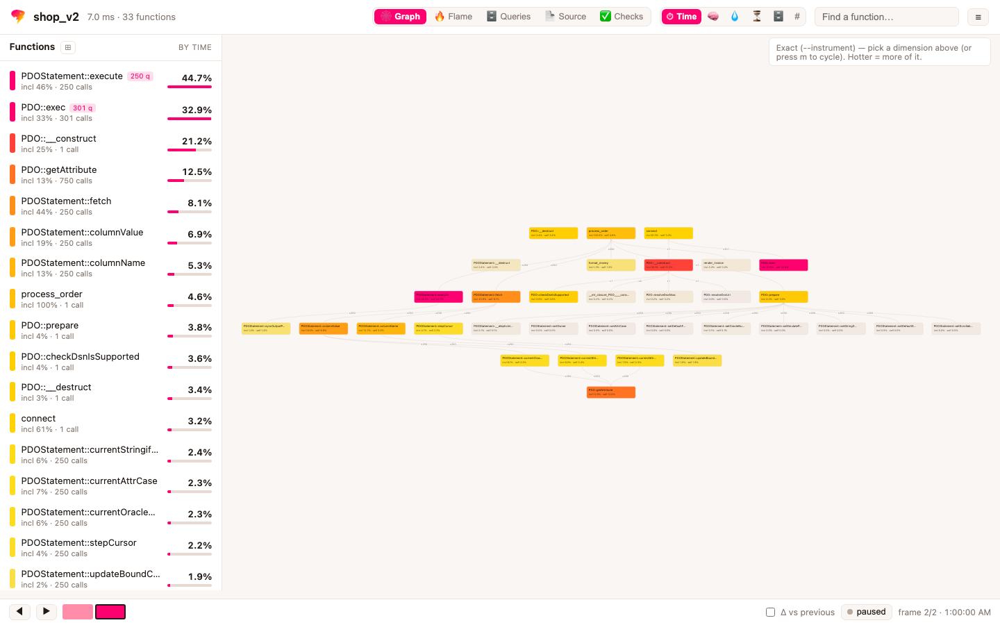

elephc profiles compiled programs at the **PHP level**. Because elephc is the
compiler, it knows every function's name, the source line of every instruction,
and what each runtime helper does — so a profile names your PHP functions, not
assembly labels, and it can translate runtime-helper time into causes a PHP
developer acts on: *heap allocation*, *Mixed cell boxing*, *reference counting*,
*dynamic Mixed arithmetic*. That cause view is the piece an interpreter-based
profiler cannot produce.

There is **one command**, and it does not change with the environment. What
changes is what you point it at:

| You have | You run | What happens |
|---|---|---|
| a source | `elephc monitor shop.php` | built with `--with-monitoring`, then read |
| a binary | `elephc monitor ./shop` | read, if it carries monitoring |
| a running service | `elephc monitor host:9411` | read through its endpoint, over `http://` or `https://` |
| a local socket | `elephc monitor /run/app.sock` | the same, on the same machine |

Every one of them produces the same table, the same numbers, the same
[Speedscope](https://www.speedscope.app) and [pprof](https://github.com/google/pprof)
exports, and the same HTML call graph. A profile taken on a laptop and a profile
taken on a production host differ in what the program did, not in what the
profiler could see.

That is the point of the design, and it is worth stating plainly: profiling in
production is normally a *different tool* answering a *smaller question* — an
approximation you learn to read differently from the exact numbers you get on a
laptop. Here it is the same mechanism, so there is nothing to learn twice and
nothing to reconcile.

## Building a program that can be profiled

```bash
elephc --with-monitoring shop.php
```

`--with-monitoring` embeds the profiling machinery in the binary: the exact
enter/exit hooks, the sampler, the symbol table both read, and a 32-byte build
key. `--with-monitoring=<names>` embeds it for named functions only (see
[below](#narrowing-it-to-a-few-functions)).

The capability is **dormant until asked**. A monitored binary run on its own
behaves exactly like one built without it — same output, nothing on stderr — and
turns nothing on until `elephc monitor` connects or a signed request arrives.
That is what makes it safe to ship the same artifact you profile.

A binary built *without* the flag has nothing to read, and `monitor` says so and
stops:

```text
elephc monitor: ./shop was not built with --with-monitoring, so there is nothing
to monitor.
  Rebuild it:  elephc --with-monitoring shop.php
  Or point monitor at the source and let it build:  elephc monitor shop.php
```

It refuses rather than falling back to a lesser profile on purpose. A degraded
answer that looks like the real one is worse than no answer: you would read the
numbers as exact and act on them.

### What it costs

**About 30 ns per profiled function call**, and nothing at all the rest of the
time. That is the whole cost model; every percentage below is that figure
multiplied by how many calls a program makes, divided by how long it runs.

On the demo service — 35 instrumented functions, ~550 queries, twenty orders,
**135,351 profiled calls** in a quarter of a second:

| | CPU time | overhead |
|---|---|---|
| built without it | 247 ms | — |
| `--with-monitoring`, nobody asked | 247 ms | +0% |
| `--with-monitoring`, profiling | 254 ms | **+3%** |
| `--with-monitoring=` 3 functions, profiling | 251 ms | +2% |

and the binary grows 219 KB (38.1 → 38.3 MB, +0.6%).

The second row is the one that decides whether you ship it everywhere, and it
does not register: a dormant binary's cost is one flag check per call, below what
this measurement resolves. The third row is paid only while a profile is actually
being taken — one run, or one request carrying the header.

**Do not carry the +3% to your own program.** 135,351 calls × 30 ns is 4.1 ms,
which is what that percentage is; a program's own figure depends entirely on how
much work it does per call. A loop that is almost nothing but calls — two million
of them in 130 ms, one every 65 ns — pays **+48%** with the same runtime on the
same machine. Same profiler, same day, sixteen times the percentage. Estimate
`30 ns × your call count` instead, or measure your own program: the table above
is one data point about a service that talks to a database, not a property of the
tool.

> **Benchmarking this inside a clone of elephc?** You will measure roughly seven
> times these figures — +3% dormant, +22% profiling, +964 KB — and nothing is
> wrong. A bridge archive is resolved from the directory the compiler itself
> lives in, so an installed elephc links the release build of `elephc-instr`
> while a source checkout links the debug one: the same instrumentation, one of
> them unoptimized, at about 165 ns per call instead of 30.

Two things about the method, both learned by getting them wrong. All variants are
built first and then timed round-robin, each keeping its minimum: timed one after
another instead, this machine drifted far enough between the first variant and
the last that three named functions came out *slower* than instrumenting all
thirty-five — an ordering that cannot be true. And the figures are CPU time, not
wall clock. On a busy machine wall clock counts the time a process spent waiting
for a core, which is the neighbours' work rather than this one's; measured that
way the same column moved from +1% to −3% between two passes, and a build cannot
be faster than the build without it.

The 30 ns is down from about 43. The caller→callee map hashed its keys with
SipHash — the default, chosen to make hash flooding impractical when keys come
from outside — and these keys are function ids the compiler assigned, which
nothing at run time can influence; the defence cost more than everything it
defended. And the clock was `clock_gettime`, 23 ns a read for a value that
resolves to one microsecond, where the counter register behind it costs 0.33 ns
and ticks every 41 ns — cheaper *and* twenty-four times finer, which is not a
trade at all. Ticks are converted to nanoseconds once, at render.

## Quick local profile

```bash
# The build is implicit for a .php target.
elephc monitor hot.php
```

Output is a per-function table with proportion bars; under each function, the
runtime time is broken down by cause:

```text
hot_leaf                   ██████████████████░░░░  79.2%  self  4.0%
    memory release         ██████░░░░░░░░░░░░░░░░  22.1%
    heap allocation        ████░░░░░░░░░░░░░░░░░░  19.4%
    Mixed cell unboxing    ██░░░░░░░░░░░░░░░░░░░░  11.2%
    Mixed cell boxing      ██░░░░░░░░░░░░░░░░░░░░   7.4%
```

That cause breakdown is the piece worth pausing on: `hot_leaf` spends 79% of the
run and only 4% of it in its own PHP — the rest is the runtime, itemized by what
it was doing.

`monitor` also writes a Speedscope file (`--out`, default
`<target>.speedscope.json`) with two views: **PHP (helpers folded)** shows only
your functions, and **Why (runtime)** keeps the helper frames annotated with
their cause. In GitHub Actions it appends the same report to the job summary
(a Markdown table plus a Mermaid cause chart) when `$GITHUB_STEP_SUMMARY` is set.

### Live view and attaching

```bash
elephc monitor hot.php --live          # top-style, refreshed each window
elephc monitor --attach <pid> --live   # profile a process already running
```

These two are the exception to *exact by default*, and the only place the
distinction still surfaces. They read a process from the **outside**, once per
millisecond of CPU time, because that is the only way to look at a program that
is already running under someone else's control. So their numbers are sampled
estimates, they cannot see time spent blocked on I/O, and they need
`/usr/bin/sample` — which ships on macOS only.

`--live` refreshes a top-style table once per window (`--duration`, default 3s in
live mode) with trend arrows against the previous window and a cumulative share.
`--attach` monitors a process that is already running, and discovers and merges
its worker children — so a `--web` prefork server is measured across all its
workers. When the target is a `.php` source and its `.dSYM` is present, calls the
inliner erased reappear as virtual `name (inlined)` frames, recovered from the
source spans the inliner preserved.

On Linux, and whenever you want the exact numbers instead, the answer is the
endpoint: run the program with `ELEPHC_PROBE_ADDR` set and point `monitor` at
the address ([below](#profiling-something-that-is-already-running)).

## CI regression gate

Capture a baseline, then fail a build when a function grows:

```bash
elephc monitor app.php --save baseline.json                    # once, on main
elephc monitor app.php --baseline baseline.json \
                       --fail-on-regression 5                  # in CI
```

`--save` writes the capture; `--baseline` reads one back. The delta table prints
per-function shares old vs new, and `--fail-on-regression <points>` exits with
status 2 when any function's share grew by more than that many percentage
points. Because both captures are exact, a call-count change of `+1` is a real
`+1` rather than noise — no threshold padding for sampling variance.

`--out` writes a Speedscope document, which is for *reading* a profile, not for
comparing two. Passing one as `--baseline` fails the command outright rather
than passing a gate that compared nothing.

## Exporting to pprof / Pyroscope

```bash
elephc monitor app.php --pprof app.pb.gz
go tool pprof -top app.pb.gz            # or upload to Grafana Pyroscope / Parca
```

`--pprof` writes a gzip-compressed pprof profile. The route (see below) is the
outermost frame of each stack, so a flamegraph groups by endpoint for free.

## Call graph (HTML / DOT)

Where the table ranks functions and the flamegraph shows the stack, the **call
graph** shows how the program calls itself — the same view
[Blackfire](https://docs.blackfire.io/profiling-cookbooks/understanding-call-graphs)
popularized. Each PHP function is one node carrying its inclusive and self
share and its runtime-cause breakdown; each edge is a caller→callee call,
weighted by the samples that took it.

```bash
elephc monitor app.php --html app.callgraph.html   # interactive, open in a browser
elephc monitor app.php --dot  app.callgraph.dot    # Graphviz source
dot -Tsvg app.callgraph.dot -o app.callgraph.svg
```

`--html` writes a **self-contained** page — inline CSS and JS, no network, no
external graph library. It lays the graph out top-down (a `{main}` root, hotter
self-time redder), and you can hover a node for its metrics and cause bars,
click it to isolate its callers and callees, search by name, and zoom/pan.
`--dot` writes plain Graphviz for `dot`, `go tool pprof -dot`-style tooling, or
anything that reads the format. Both flags also work against a running service, so a
production capture exports the same graph.

### Reading the page



Every screenshot on this page is a real capture of the demo service under
`scripts/docs/profiling_demo/`, photographed by
`scripts/docs/profiling_screenshots.sh` — run it to regenerate them after a
change to the page.

The bar holds only what a reading loop touches — which view, which dimension,
and search. Everything set once and left alone lives behind **☰**.

```text
┌──────────────────────────────────────────────────────────────────────────┐
│ shop   14.3 ms · 35 functions    🕸Graph 🔥 🗄 📄 ✅   ⏱ 🧠Memory 💧 ⏳ 🗄 #  │
│                                                        [Find a function] ☰│
└──────────────────────────────────────────────────────────────────────────┘
```

The chosen view and dimension are filled with the accent colour, and only the
chosen dimension keeps its name — the bar reads *"Graph, by Memory"* at a
glance. Hovering any control explains what it does.



**Views** are five ways to read the same capture, and only the ones a capture
supports are offered — a sampled run has no flame graph, an exact one has no
per-line samples:

| | | |
|---|---|---|
| 🕸 **Graph** | who calls whom | one box per function |
| 🔥 **Flame** | the same tree as nested bars | width is time; click to zoom, <kbd>Esc</kbd> out |
| 🗄 **Queries** | every distinct DB statement | with its exact run count |
| 📄 **Source** | your PHP file, annotated | per function (exact) or per line (sampled) |
| ✅ **Checks** | the performance budget | and what this run measured |

**Dimensions** recolour the graph and re-sort the list: ⏱ time, 🧠 memory,
💧 retained, ⏳ wait, 🗄 SQL, \# calls. Not every capture has all six.

**The sidebar** ranks functions by the current dimension, searchable, resizable,
and groupable under classes and namespaces (⊞). Selecting one opens a bottom-up
panel of its exact callers and callees; clicking a row there walks to that
neighbour. Panning the graph keeps the selection.

**The ☰ menu** holds *Start over* (back to the graph, timed, nothing selected or
filtered), *Fit in view*, *Critical path*, the pruning threshold, the theme
(Auto / Light / Dark), and the shortcut sheet.

**Keyboard**, all listed under `?`:

| | | | |
|---|---|---|---|
| <kbd>m</kbd> cycle dimension | <kbd>f</kbd> flame | <kbd>q</kbd> queries | <kbd>s</kbd> source |
| <kbd>c</kbd> checks | <kbd>p</kbd> critical path | <kbd>0</kbd> fit in view | <kbd>r</kbd> start over |
| <kbd>d</kbd> diff vs previous | <kbd>l</kbd> follow live | <kbd>←</kbd> <kbd>→</kbd> scrub captures | <kbd>?</kbd> this sheet |

The graph frames itself on arrival and re-frames if the window changes size —
until you pan or zoom, after which the view is yours and is remembered. A stored
view that would open on empty space is discarded rather than restored.

The page follows the system's light/dark setting unless you pick one in the
menu. The heat ramp follows it too: on a dark ground a quiet function is a dark
card rather than a glaring white one, while the hot end stays gold → magenta.



### Per-line source view

A **sampled** capture (`--live`, `--attach`) can place every sample on a *source
line*, because a sample is an address and the dSYM says which line owns it. Open
the call graph and hit **📄 Source** (or `s`):

```text
  5   1.2%   $row = [$id, $id * 7, $id % 5, $id + 1];
  6
  7  68.7%   for ($i = 0; $i < 300; $i++) { $s += $row[$i % 4] + $i; }
  8          return $s;
 ...
 17  30.1%   for ($i = 0; $i < $n; $i++) { $sum += strlen((string)($i * 2654435761)); }
```



Each line carries the share of samples that landed on it, heat-colored like the
graph, so the expensive *statement* is visible, not just the expensive function.
The panel appears whenever the dSYM and the source are both present.

The **exact** capture — what you get by default — has no per-line data at all: it
times whole calls, not statements. There, the same view annotates the file **per
function**, from the exact costs and the declaration ranges. Each declaration is
labelled and its body tinted, which is the macro read of where a file spends
itself:

```text
 16   2.6%   function load_price(PDO $pdo, int $id): int {    incl 82.8% · 250 calls
 24   8.1%   function record_audit(array $log, ...): array    incl  8.1% · 250 calls
 30   0.5%   function format_money(int $cents): string {      incl  0.5% · 250 calls
 45   6.1%   function process_order(PDO $pdo, int $items)     incl 100.0% · 1 call
```



Per-line shares are **sampled by construction**, and no amount of engineering
changes that: exact per-line timing would mean a clock read at every line, far
more expensive than the code being measured. Read them accordingly — a line with
a large share really is hot, but a line at 0% was merely never caught, which is
not proof that it is free. Per-function costs, in the same panel, are exact.

### Real-time call graph

Add `--live` and the call graph becomes a moving picture — it re-captures each
window and keeps the **last 10** graphs navigable:

```bash
elephc monitor app.php --live --html live.callgraph.html
```

Open `live.callgraph.html` in a browser and leave it: the page auto-reloads as
new windows land. A bottom timeline scrubs the last ten captures (arrow keys, or
click a pill — each pill is tinted by how hot that frame ran), a **live** toggle
(`l`) follows the newest or pauses on the one you are studying, and a **Δ
vs previous** toggle (`d`) outlines every function whose self time grew since the
frame before — so you watch the hot path move as your program shifts phases
(request parsing → indexing → rendering). Every frame is drawn on one stable
layout — the union of all ten captures — so a function keeps its position while
you scrub, and your selected frame, pan, and zoom survive each update. All ten
graphs are embedded in the single self-contained file; there is still no network.

Opened as a plain file the page auto-reloads to pick up new windows. Served over
http it does better: it re-fetches itself and merges new frames **in place** —
no reload, no flicker, even when a newly-hot function first appears (the layout
reflows in place). `--serve <host:port>` runs a tiny built-in HTTP server for
exactly that:

```bash
elephc monitor app.php --live --html live.callgraph.html --serve 127.0.0.1:9000
# then open http://127.0.0.1:9000/
```

Bind a loopback address unless you intend to expose the profile; the server has
one resource (the graph) and serves nothing else.

## Profiling something that is already running

A program you launch is profiled by launching it. A program already serving
traffic is profiled by **connecting to it** — same command, an address instead of
a path.

Three things are separate here, and the whole model is easier to hold once you
have seen them apart. Compiling gives the binary the **capability**. Starting it
with an address opens the **endpoint**. Reading it takes the **key** — always,
whatever the transport:

```console
$ elephc --with-monitoring service.php
probe build fingerprint: 9b28f463
Compiled 'service.php' -> 'service'

$ ls service*
service   service.key   service.php          # a binary and a key. No socket.

$ ./service &                                # runs like any other binary
$ ls /tmp/app.sock
ls: /tmp/app.sock: No such file or directory

$ ELEPHC_PROBE_ADDR=/tmp/app.sock ./service &        # now the endpoint opens
$ ls -l /tmp/app.sock
srw-------  1 you  wheel  0 Aug 19 10:45 /tmp/app.sock

$ elephc monitor /tmp/app.sock --key service.key
connected to probe build 9b28f463
samples: 86
...
```

The fingerprint printed at compile time and the one printed on connecting are the
same value, which is the point of printing it twice: it says you reached the
build you think you reached, and it appears *after* the handshake, so it reports
what was proven rather than what was claimed.

`ELEPHC_PROBE_ADDR` takes a `host:port` just as happily, which is the same flow
with the socket replaced by a listening port:

```bash
ELEPHC_PROBE_ADDR=127.0.0.1:9411 ./app       # on the server

elephc monitor 127.0.0.1:9411 --key app.key            # from your machine
elephc monitor https://app.internal:9411 --key app.key # across a network
```

Nothing about the binary changes between those runs: the same
`--with-monitoring` artifact you run in CI is the one serving here.

`--with-monitoring` generates a **32-byte build key**, embeds it in the binary,
writes it to a `<binary>.key` sidecar, and prints its public fingerprint at
compile time. Keep the sidecar like a `.env` secret — it is what a remote
profiler uses to prove it is talking to *your* build.

The two ends run a mutual HMAC handshake: the server proves it holds the build
key (so you never profile an instance you do not control), and the client proves
it holds the key (so a stray connection cannot read your production stacks). No
secret crosses the connection, and a party that cannot prove the key is
disconnected before any samples are sent. The build fingerprint is printed on
both sides so you can confirm you reached the intended deployment — and it is
printed *after* the handshake, so it reports what was proven rather than what was
claimed.

Over `https://` the certificate is validated against the system roots before any
of that happens: a self-signed or expired certificate stops the connection. That
check is not ceremony — an attacker who can answer the handshake receives a
profile, and a profile is the shape of your code and the URLs it serves.

Locally, `elephc monitor ./app` needs no key and no address. It passes the
program a **control channel** — a socket on fd 3 — and possession of that channel
is the credential: there is nothing to copy, leak, or replay, because it exists
only for as long as the two processes are connected.

`ELEPHC_PROBE_ADDR` does two things, and only one of them is obvious. It opens
the endpoint — which still refuses everyone who cannot prove the build key, so
that half is a deployment decision like binding a port. But it also **arms the
sampler**, and a run started with it writes a profile to stderr at exit whether
or not anyone ever connects. Measured, not inferred: a program run with the
variable set prints `elephc-probe:` lines on its way out.

So it is the one switch that turns collection on without a key. It cannot read
anything back — that still takes the handshake — but if a stray profile on stderr
would surprise you, do not set it and use `elephc monitor <binary>` instead, which
asks over the control channel and leaves the environment alone.

If the address is a path and the bind fails, the program says so on stderr. The
commonest cause is invisible otherwise: a `sockaddr_un` holds about 104 bytes, so
a socket under a deep directory never binds.

### One request in production

A `--web` service also answers a signed **`X-Elephc-Query`** header, which
profiles that single request and leaves every other one untouched:

```text
X-Elephc-Query: t=<unix seconds>,v=<hex hmac of the timestamp>
```

The value is signed with the build key and carries a timestamp, so it cannot be
forged by someone who can set headers, and a captured header stops working within
five minutes of the server's wall clock. That is the clock it has to be — the
timestamp was minted on another machine, so a monotonic one would mean nothing —
which makes the window sensitive to a backwards time correction on the server and
to clock skew between the two hosts. An invalid or missing value profiles nothing — the request runs
exactly as it would have. (This is the shape Blackfire uses, for the same reason:
turning profiling on costs the request real time and reveals the code, so asking
has to be something only a key holder can do.)

### `--web` servers: all workers, per route

Under `--web` the sample ring lives in shared memory allocated before the
prefork, so every worker samples into one ring the master's endpoint serves — a
single connection sees the whole server, not one worker.

Samples taken while a worker is handling a request are tagged with the request
route (`METHOD /path`), which becomes the outermost frame of the stack. The
table, the flamegraph, and the pprof export therefore group by endpoint:

```text
GET /api/orders   ██████████████████████ 98.4%
  {main}  serialize  <native>...
```

Route names are sanitized (a `;` or a newline from a crafted path cannot forge
frames), and the distinct-route table is capped at 256; pass **route patterns**
(`/users/{id}`), not raw paths, so a crawler cannot exhaust it.

## What the numbers are

The profile is **exact, not sampled**: the binary counts every entry and times
every call from a real enter/exit shadow stack, and writes the result to stderr
at exit.

```text
elephc-instr: {fn} calls=<n> incl_ns=<ns> excl_ns=<ns> incl_allocs=<n> excl_allocs=<n> incl_io=<n> excl_io=<n> incl_ret=<n> excl_ret=<n> incl_wait=<ns> excl_wait=<ns>
elephc-instr-edge: {caller} -> {callee} count=<n> ns=<callee ns under caller>
elephc-instr-query: <count> <normalized SQL text>   (one per distinct statement, if any DB ran)
```

`elephc monitor` reads those lines and renders them; you rarely see them
yourself. `calls` is the true invocation count, `incl_ns` the wall time between
enter and exit (the outermost activation for a recursive function, so recursion
is not double counted), and `excl_ns` the function's own time (inclusive minus
its callees'). Across a run the exclusive times sum to the root's inclusive — a
real partition of the program's time.

A **sampled** view exists alongside it, and two things use it: `--live` and
`--attach`, which read a process from the outside ~1000 times per second of CPU
time. Sampled shares are estimates that sharpen as samples accumulate, they carry
noise (around ±0.3 points at ~1,500 samples), and time spent *blocked* on I/O is
invisible to them because the CPU-time timer does not tick while a program waits.
Where a page or a table shows sampled numbers it says so.

### Narrowing it to a few functions

```bash
elephc --with-monitoring=process_order,'PDOStatement::*' app.php
elephc --with-monitoring=@hot-functions.txt app.php
```

Hooks land only on the functions you name; a trailing `*` matches by prefix, and
`@file` reads one name per line. Everything else runs at full speed — on the demo
service, profiling all 35 functions costs +3% while three named ones cost +2%.
What that saves is proportional to the calls it removes, so the narrowing pays on
a program whose hot functions are called often ([full table and the cost model
above](#what-it-costs)).

A natural way to build the list is to let a first, whole-program profile pick it:
profile once, take the functions that dominate, and name those.

**It changes what "self" means, and the run says so.** An uninstrumented callee
runs inside its instrumented caller's frame, so its time lands in that caller's
self rather than in a child — self values stop summing to the root's inclusive,
which is the property the full mode's numbers rest on. Every selective run prints:

```text
elephc-instr: note: selective instrumentation — self time includes any
uninstrumented callees, so self values do not sum to the root's inclusive
```

You can see it in the data: instrument `load_price` but not the PDO methods it
calls, and `load_price` reports `excl_ns` equal to its `incl_ns`.

#### What "exact" does and does not cover

The numbers are exact in the sense that every call is counted and timed rather
than sampled. Four boundaries are worth knowing, because each one is a place
where a figure would otherwise be trusted further than it should be:

- **Frames beyond 65,536 deep are not timed.** The shadow stack is capped so a
  runaway recursion degrades instead of growing without bound. Past the cap,
  calls are still counted but carry no time, and `monitor` says so: *"905 calls
  beyond depth 65536 were not tracked"*. The frames that fit are unaffected.
  The cap costs nothing until it is approached — the stack grows on demand — so
  reaching it at all means the recursion is worth looking at on its own.
- **An exception's frames are closed when the throw is observed**, not when it
  was raised — their exit hooks never run. The error is the distance between the
  throw and the catching function's return, and the cost stays on the frame that
  incurred it rather than on the catcher.
- **Inlined functions fold into their caller** and do not appear at all, exactly
  as with `--counters`.
- **Shares are relative to the largest inclusive time in the capture.** When
  `{main}` is not instrumented and a program has several independent top-level
  calls, their self shares can therefore sum past 100%.
- **A suspended generator keeps its frame**, so work done between two resumes is
  attributed as if it happened *inside* the generator. Self time is unaffected —
  the hotspot table stays correct — but the generator's inclusive share, its
  edges, and therefore the graph and flame shapes name the wrong caller:

  ```php
  foreach (produce($n) as $v) { burn($work); }   // burn is called by the LOOP
  ```
  ```text
  elephc-instr-edge: produce -> burn count=200   # ... but recorded under produce
  ```

  Read the exclusive column when generators are involved. Fixing this needs the
  frame to be popped on yield and pushed on resume.

**Memory too.** `incl_allocs` / `excl_allocs` are the exact number of heap
allocations attributed to each function — the same shadow-stack math applied to
the allocation counter instead of the clock, so allocation counts also partition
exactly. Because elephc *is* the allocator, this is exact and free of extra
bookkeeping — the second dimension Blackfire is known for, measured rather than
sampled. (A useful surprise it surfaces: in elephc, arithmetic on `mixed`-typed
values allocates, so a hot integer loop can be an allocation hotspot.)

**And queries.** `incl_io` / `excl_io` count **database queries** per function
(PDO statement executions and `PDO::exec`), attributed the same exact way. That
turns N+1 detection from a heuristic into a certainty: when a caller invokes a
callee many times and that callee issues one query each, the recommendation says
so outright — "*N+1: `list_all` calls `get_user` 200 times and `get_user`
issues 200 DB queries — batch them into one query*". `monitor`
shows a `queries` column and per-function query counts in the graph tooltips.
(HTTP has no client bridge in elephc yet; filesystem I/O can be added on the same
runtime hook.)

**And what stays behind.** `incl_ret` / `excl_ret` are **retained** objects —
allocated minus freed — attributed per function the same exact way, by reading
the free counter (`_gc_frees`) alongside the allocation counter at each hook.
It answers a different question from *Memory*: not how much a function churned
through, but how much it left on the heap when it returned. The value is
**signed**, so a function that releases more than it takes reports negative, and
the self values still partition the root's total. The two dimensions genuinely
disagree — here `churn` is the biggest allocator while `hoard` is the leak:

```
churn   incl 100.0%  self 100.0%  calls 1  allocs 40001  retained     +2
hoard   incl  98.7%  self  98.7%  calls 1  allocs 20014  retained +20001
```

A function that keeps most of what it allocates gets called out directly —
"*`hoard` retains the most — 20001 of its 20014 allocations (100%) are still
live when it returns; check for a cache or collection that only grows*".

**And CPU vs waiting.** `incl_wait` / `excl_wait` are the nanoseconds a function
spent **blocked inside a driver call** rather than running PHP. The PDO bridge
times the database work — statement execution and `PDO::exec`, across every
driver — and reports the elapsed time through the same pay-for-use slot
mechanism, so the profiler can split every function's self time into CPU and
wait. Note the scope: *database* work. File and network I/O outside PDO are not
yet timed, so they read as CPU.

```
PDO::exec              self 1.8 ms   wait 1.4 ms   cpu 363.7 µs
PDOStatement::execute  self 2.9 ms   wait 167.0 µs cpu 2.8 ms
PDO::prepare           self 2.1 ms   wait 0 ns     cpu 2.1 ms
```

That distinction decides where tuning pays: `PDO::exec` above is *not* slow PHP,
it is the database; `PDO::prepare` is genuinely PHP-side work. When a quarter or
more of the run is spent blocked, the recommendations say so outright — "*the
run is I/O-bound: 41% of it (1.4 ms) is spent waiting on the database — PDO::exec
blocks longest; batching or caching queries will beat any PHP-side tuning*". The
timing costs nothing in a normal binary: with the profiler unlinked the slot is
zero and the bridge never even reads the clock.

`elephc monitor` renders those numbers as a table and, with `--html` / `--dot`,
as a call graph labeled *exact* (cost is a share of measured time, and call
counts are exact):

```bash
elephc monitor app.php --html app.exact.html
```

In the exact HTML the dimension switch (⏱ Time / 🧠 Memory / 💧 Retained / ⏳ Wait /
🗄 SQL / # Calls, or the `m` key) recolors the whole graph — the hot node becomes the
biggest allocator, the biggest retainer, the one that blocks longest, the
busiest query issuer, or the most-called function, and each node's tooltip carries the exact inclusive/self
numbers. It is the same dimension switch Blackfire offers, on measured data.

### Reading the exact call graph

The exact page carries the views you reach for when a graph gets big, all
driven by the measured numbers (they need the exact per-edge weights, so they are
absent from a `--live` or `--attach` capture):

- **🔥 Flame** (`f`) swaps the node-link graph for an icicle built from the exact
  inclusive-time tree — each child's width is its share of its parent's time.
  Click any frame to zoom in on that subtree; `⌂ reset` or `Esc` zooms back out.

  

- The **bottom-up panel** opens under the sidebar when you select a function: its
  exact callers and callees, each with the call count along that edge and the
  time it contributes. Click a row to walk to that neighbour. An N+1 reads
  straight off it — `get_user ← list_all ×200`, and `get_user → {prepare,
  execute, fetch} ×200` each.
- **⚡ Path** (`p`) highlights the heaviest root→leaf chain for the current
  dimension, edge thickness tracks each callee's inclusive share, and the
  threshold selector (All / ≥1% / ≥5% / ≥10%) prunes the long tail.

### SQL queries (the N+1 view)



When the run touched a database, a **🗄 Queries** panel (`q`) lists every distinct
statement and how many times it ran. Query text is normalized — string and
numeric literals collapse to `?` — so 200 executions of the same prepared
`SELECT`, or 200 `INSERT`s with different values, each fold into a single row
whose count is the smoking gun. Statements that ran many times are flagged
`N+1?`:

```
Runs                     Statement
×200   ████████████████  SELECT name FROM users WHERE id = ?   N+1?
×200   ████████████████  INSERT INTO users (name) VALUES (?)   N+1?
×1     ▏                 CREATE TABLE users (id INTEGER …, name TEXT)
```

The counts are exact: the PDO bridge reports each executed statement to the
profiler (pay-for-use — a binary built without the capability records nothing), so the
panel and the N+1 recommendation below agree by construction.

### Distributed profiling (W3C Trace Context)

Under `--web --with-monitoring`, each request is profiled as its own slice and that
slice carries a **trace identity**, so profiles taken in different services
link into one distributed trace:

```text
elephc-instr-trace: trace=35bd350e10388a888de06d4020ca84fa span=acef53ab67c88954 parent=-
```

elephc speaks the standard [W3C Trace Context](https://www.w3.org/TR/trace-context/)
`traceparent` header rather than a private one. That choice matters: an elephc
profile joins whatever trace its caller already belongs to — an OpenTelemetry
service, Jaeger, Datadog, nginx, or another elephc binary — instead of forming
an island only elephc tooling can read. When a request arrives with a valid
`traceparent`, the slice continues that trace as a child span; otherwise it
starts a new one. A malformed header always starts a fresh trace, so a caller
cannot inject text into your profile output.

To carry the trace onward, read the value the profiler publishes for the
current request and pass it on:

```php
$ctx = stream_context_create(['http' => [
    'header' => "traceparent: " . getenv('ELEPHC_TRACEPARENT') . "\r\n",
]]);
$fh = fopen('http://inventory.internal/stock', 'r', false, $ctx);
```

`ELEPHC_TRACEPARENT` is refreshed at the start of every request and already
carries *this* slice's span id, so the callee records it as its parent. Nothing
else is needed — no extra flag, no new builtin, and non-instrument binaries
carry none of this machinery (the runtime slot stays zero).

The result across two elephc services and an external caller:

```text
caller (any OTel service)  trace=1111…8888  span=aaaabbbbccccdddd
  service A                trace=1111…8888  span=604e39a69a8d26e2  parent=aaaabbbbccccdddd
    service B              trace=1111…8888  span=13b8fb9994026a78  parent=604e39a69a8d26e2
```

Propagation currently reaches the HTTP stream layer (`fopen("http://…")` with a
stream context). elephc has no `curl` yet, so an application that calls out
through curl cannot propagate; that is the practical limit today, not the
mechanism.

#### Correlating the services

Collect each service's stderr and hand the logs to `--stitch` (repeatable). It
captures nothing itself — it correlates slices that were already recorded:

```bash
elephc monitor --stitch gateway.log --stitch inventory.log
```

```text
distributed traces — 3 trace(s) over 9 slice(s)

trace 1a03577bf4ef56af5d28e7932937e56f
● gateway  8.9 ms  ████████████  2 fn
  └─ inventory  2.2 ms  ···███░░░░░░  1 fn
  └─ inventory  2.3 ms  ·········███  1 fn
```

The bars are a waterfall in the terminal too: leading `·` is time before that
span started. Two hops one after the other step rightwards, as above; two that
overlapped would share a starting column. That distinction is the reason to
correlate services at all, so it is in the default output rather than only in
the chart.

The report opens with a **per-service summary**, which is the part an operator
reads first:

```text
per service

service                               n        p50        p90        p95        p99      rps    q/req    wait
gateway · GET /                      25     5.2 ms     5.6 ms     5.9 ms     6.1 ms    144.6      0.0      0%
inventory · GET /                    50     1.3 ms     1.4 ms     1.4 ms     1.5 ms    292.6      0.0      0%
```

Rows split per endpoint when every slice names one, because a service-wide p95
averages away the one slow route you are looking for. Percentiles are
nearest-rank: each is a duration some request actually took, rather than an
interpolation nobody experienced. Under 20 requests the report says so — at that
count the upper percentiles *are* the slowest requests, and calling them "p99"
would dress a maximum up as a distribution. The rate is omitted rather than
invented when the slices carry no timestamps, or all share one instant.

Each line below is one span: the service (named after its log file), its exact
duration, its share of the trace, how many functions ran, and — when non-zero —
its query count and time spent waiting. A span whose parent is missing from the
collected logs is shown as a root rather than dropped, so a partial collection
still renders what it has.

Add `--html` for the same thing as a chart — each span placed by when it opened
and sized by how long it ran, and opening a row reveals that service's hottest
functions, so a slow hop is diagnosable without going and finding its own
profile:

```bash
elephc monitor --stitch gateway.log --stitch inventory.log --html trace.html
```

It is a **waterfall**: a slice stamps the wall clock when its trace context
opens, so spans are placed on a shared axis rather than all drawn flush left.
Two children of one service therefore read differently depending on what
actually happened — one after the other, or overlapping.

The axis is wall clock, which is the only clock two hosts share, so this carries
the caveat every distributed tracer carries: their clocks can drift apart, and a
hop may appear to start a hair before its parent. And a trace is placed only when
**every** span in it is dated; if one is not (a capture taken before slices
carried timestamps), the whole trace falls back to duration-only bars, because a
single undated span pinned at the origin would read as "started first" rather
than "unknown".

#### Sending it to OpenTelemetry

```bash
elephc monitor --stitch gateway.log --stitch inventory.log \
               --otlp http://127.0.0.1:4318 --prometheus elephc.prom
```

`--otlp` posts the slices as **OpenTelemetry spans**. elephc already carried the
W3C trace identity — the service belonged to its caller's trace whether or not
anything was exported — so what this adds is that the hop stops being a *gap* in
that trace and starts being a span with its own duration, route, query count and
time spent waiting.

Plain HTTP to a local agent is the intended deployment, so an https endpoint is
refused with that advice rather than a socket error: a remote or authenticated
collector belongs behind a sidecar, which keeps a TLS stack and a credential
store out of the compiler. Slices without timestamps are skipped and counted,
because OTel needs both ends of an interval and exporting them at epoch 0 would
file the lot under 1970.

**Profiles are not exported over OTLP, on purpose.** That signal entered public
alpha in 2026 and its own SIG advises against depending on it. It is also
unnecessary: OTLP Profiles round-trips losslessly with pprof, and the Collector
ships a `pprof` receiver — so the `--pprof` file elephc already writes reaches an
OTel backend today, without this compiler chasing a moving wire format:

```yaml
receivers:
  pprof:
    endpoint: 127.0.0.1:4319
service:
  pipelines:
    profiles:
      receivers: [pprof]
      exporters: [otlp]
```

`--prometheus` writes the per-service stats in the text exposition format, for a
textfile collector. A file rather than an endpoint, because `monitor` runs and
exits and leaves nothing to poll; percentiles are a `summary` rather than a
histogram, because we hold exact per-request values and buckets would invent a
resolution the capture does not have.

### Timeline (Perfetto)

The call graph collapses time; a **timeline** keeps it. Because the profile
records every call's enter and exit, it can emit a real wall-clock trace:

```bash
elephc monitor app.php --trace app.trace.json
# then open app.trace.json at https://ui.perfetto.dev (or chrome://tracing)
```

Each call becomes a nested slice, so you see the actual sequence and duration of
calls over time — the view sampling cannot produce. It writes the
[Chrome Trace Format](https://perfetto.dev/docs/reference/synthetic-track-event),
so any Perfetto/`chrome://tracing`-compatible viewer opens it. Standalone, set
`ELEPHC_INSTR_TRACE=<path>` (and optionally `ELEPHC_INSTR_TRACE_MAX=<n>`) when
running a monitored binary. The trace is bounded (500k calls by default)
so a hot program's trace stays openable; the overflow count is reported.

### Recommendations and assertions

`monitor` ends with a short **recommendations** section — the time
hotspot, the allocation hotspot, functions whose per-call cost hints at call
overhead, and **high fan-out edges** (a callee invoked many times from one
caller — the classic **N+1** shape if that callee touches the database, network,
or filesystem). These come straight from the exact call counts on each edge, so
the count in "calls `render` 1,200 times" is exact, not sampled. (A full
per-query *dimension* — counting SQL statements or HTTP requests per function the
way Blackfire does — would need a runtime hook in each such builtin; the fan-out
heuristic surfaces the same N+1 pattern from data elephc already has.)

For CI it also gates on exact metrics. Each `--assert <metric>:<fn><op><value>`
is checked against the profile, and any failure exits the command with status 2:

```bash
elephc monitor app.php \
  --assert 'calls:render<=1' \
  --assert 'self_ms:parse<10' \
  --assert 'allocs:build<=5000'
```

Every measured dimension is assertable — `calls`, `allocs`, `retained`,
`queries`, `self_ms`, `incl_ms`, `wait_ms`, `time_pct` — with the operators
`<= >= == < >`. Use `*` as the function to assert on the **whole run**:

```bash
elephc monitor app.php \
  --assert 'queries:*<=50' \
  --assert 'wait_ms:*<=5'
```

Because the numbers are exact, an assertion like "this endpoint issues at most
one call to `render`" is a hard, non-flaky gate — not a sampled approximation.

#### A budget per project

Passing the same flags on every invocation does not survive contact with a team,
so a project keeps its budget in a **`.elephc`** file. It is found by walking up
from the profiled source, the way `.editorconfig` and `.gitignore` are, so one
file at the project root covers everything under it and profiling
`src/deep/thing.php` still finds it. A nearer `.elephc` wins over the root: the
closest budget is the one describing that code. `--assert-file <path>` names one
explicitly, and `--assert` flags still apply on top.

The search is anchored on the *source*, not the working directory — where you
run the profiler from cannot silently change which budget gates the build.

```text
# .elephc — performance budget for the order service.
# One assertion per line: <metric>:<function><op><value>
# `*` targets the whole run. Text after `#` labels the assertion.

calls:PDO::prepare    <= 10       # prepare once per request, not per row
retained:record_audit <= 1000     # the audit log must not hoard
queries:*             <= 100      # whole-run query budget
wait_ms:*             <= 50       # and the database must not dominate
```

Same syntax as the flag, so there is one thing to learn. The label after `#` is
the point of the file: a red gate that says *why* a budget exists is actionable
where a bare number is not.

The report lists failures first — a gate is read when it is red — with the
counts up front:

```text
assertions — 3 passed, 3 failed, 1 not evaluated
  [FAIL] calls:PDO::prepare    <= 10 (actual 250)  — prepare once per request, not per row
  [FAIL] retained:record_audit <= 1000 (actual 31625)  — the audit log must not hoard
  [FAIL] queries:*             <= 100 (actual 551)  — whole-run query budget
  [SKIP] calls:nonexistent     <= 1 ('nonexistent' never ran)
  [PASS] wait_ms:*             <= 50 (actual 2.034)  — and the database must not dominate
```

`SKIP` is deliberately distinct from `FAIL`: an assertion naming a function the
run never reached, or a metric that does not exist, says something is wrong with
the *budget*, not with the code — but it still fails the gate, because a budget
that silently measures nothing is worse than no budget.

With `--html` the same verdicts become a **✅ Checks** panel (key `c`) listing
each assertion with its measured value beside its budget.



### Before / after diff

`--save <file.json>` stores an exact capture; feeding it back as `--baseline`
prints a per-function delta table (time share and call count, before → after)
and, with `--html`, a **two-frame diff graph** — the navigator scrubs between
baseline and current, and the diff toggle lights up every function that grew:

```bash
elephc monitor app.php --save before.json                   # on main
# ... make a change ...
elephc monitor app.php --baseline before.json --html diff.html
```



Because both captures are exact, a call-count change of `+1` is a real `+1`
(the sampled `--baseline` above is the statistical equivalent for a `--live` capture).

The trade-off is overhead: two clock reads and a bookkeeping update per call.
That is the +3% in the table above, and it is why the hooks stay dormant until
asked and why `--with-monitoring=<names>` exists — a production service profiles
what matters and leaves the rest at full speed. Inlined functions fold into their
caller (they have no prologue to hook), exactly as with `--counters`; and time
spent on a path that throws is attributed best-effort (the shadow stack
resynchronizes after an exception unwinds past a missed exit). Instrumentation is
per-thread and reports the main thread at exit, which is the whole program for
single-threaded PHP.

## Exact call counts

For exact (not sampled) per-function call counts, compile with `--counters`:

```bash
elephc --counters app.php
./app          # prints, to stderr at exit:
# elephc-counters: hot_leaf 40
# elephc-counters: call_hot 0
```

Each PHP function gets one BSS counter incremented in its prologue. A fully
inlined call site keeps its counter at **zero** — so a zero next to a hot
sampled function makes inlining visible by difference.

## Security model and caveats

- **The trigger is the credential, and there are three of them.** Locally, a
  control channel on fd 3 that `monitor` hands the program it launched:
  possession is the proof, and there is nothing to copy or replay. Remotely, the
  32-byte build key, proven by both ends before a single sample crosses.
  Per-request, a signed `X-Elephc-Query` header with a five-minute window.
  Deliberately absent: an environment variable that turns profiling on, because
  anyone who can set one could then profile a service they do not own.
- **Anyone who can read the *binary* can extract the key.** The handshake
  protects against other processes and other hosts, not against someone who
  already has the artifact — so on a host with untrusted local users, every one
  of them holds the profiling credential for anything deployed world-readable
  there. The `<binary>.key` file is written `0600`, and a Unix probe socket is
  chmod `0600`, but the binary's own permissions are yours to set.
- **The handshake authenticates; it does not encrypt.** Over `host:port` or a
  Unix socket, someone positioned in the middle can relay both sides' proofs and
  then read the profile that follows without ever holding the key. Nothing is
  forged and no secret leaks, but the capture is readable. Use `https://` across
  any network you do not control.
- **Plaintext after the handshake.** Over a Unix socket or loopback that is
  fine. Across a network, use `https://` — the certificate is validated against
  the system roots, and an untrusted one stops the connection — or tunnel over
  SSH.
- **Unix socket paths are limited to ~104 bytes** (`SUN_LEN`). Keep the socket
  in `/tmp` or `/run`.
- **Route names come from requests.** They are sanitized (a `;` or a newline from
  a crafted path cannot forge frames) and the distinct-route table is capped at
  256 — pass **route patterns** (`/users/{id}`), not raw paths, so a crawler
  cannot exhaust it.
- **Self re-exec.** A program that calls `execve` *without* forking (a graceful
  self-restart) keeps the armed sampling timer, which would kill the new image.
  Call the exported `elephc_probe_disarm` before such an exec. Ordinary
  `exec()`/`proc_open`/`popen` (which fork first) are already safe.
- **`--live` and `--attach` are macOS-only.** They read a process from the
  outside, which needs `/usr/bin/sample`; no equivalent ships on Linux. The
  Linux answer is not a lesser profile, it is a better one: run the program with
  `ELEPHC_PROBE_ADDR` set and read it with `elephc monitor <addr>`, which reaches
  a live process, needs no external tool, and returns exact numbers rather than
  sampled ones. Everything else — profiling a source, a binary, a service, the
  assertions, the exports, `--stitch` — is platform-independent.
- **Sampled captures are CPU-time only.** `--live` and `--attach` sample on the
  CPU-time timer, so time spent blocked on I/O is not attributed in those two
  modes. The exact profile measures wait time directly (see *CPU vs waiting*
  above). On Apple `arm64e` builds, PAC-signed return addresses degrade sampled
  stacks to `<native>`; the default `arm64` target is unaffected.

See the [CLI reference](../compiling/cli-reference.md) for the full flag list.
